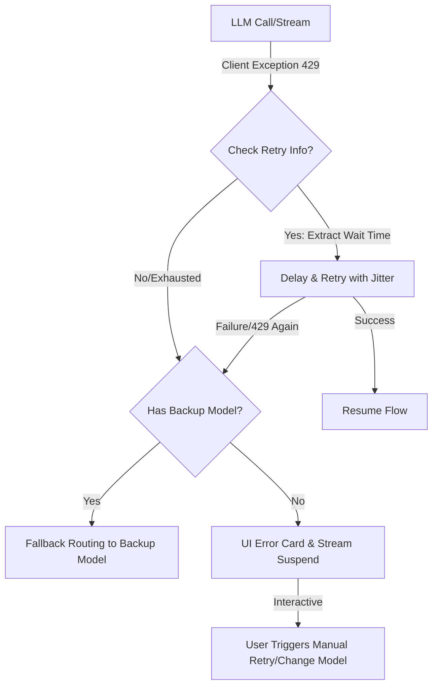

# Human-in-the-loop 机制与 429 频率超限优化策略研究

本报告对 DeerFlow 中的 Human-in-the-loop（人机协同）Prompt 触发机制进行总结，并针对 Google GenAI 接口在流式/非流式调用中抛出的 429 (Quota Exceeded / Rate Limit) 异常提出系统性的链路设计与用户体验优化方案。

---

## 第一部分：Human-in-the-loop 提示词与交互机制总结

在 DeerFlow 2.0 的设计中，像 **Clarification (澄清问卷)** 和 **Approval (高危操作审批)** 这样的人机协同行为，其核心驱动力是系统级 Prompt 规范与框架拦截器的紧密配合。

### 1. Clarification (澄清机制)
大模型主要通过决策调用特定的 **结构化工具 (`ask_clarification`)** 来要求人工干预，而不是用普通文本形式向用户提问。

* **引导决策的 System Prompt 约束 (在 `LeadAgentPromptTemplate.java` 中定义)：**
  * **思考约束 (`<thinking_style>`)**：
    > *PRIORITY CHECK: If anything is unclear, missing, or has multiple interpretations, you MUST ask for clarification FIRST - do NOT proceed with work*
  * **工作流约束 (`<clarification_system>`)**：
    * 明确了 **"CLARIFY -> PLAN -> ACT"** 的工作流。
    * 定义了五大强制澄清场景（如 `missing_info` 缺失信息、`ambiguous_requirement` 歧义需求、`approach_choice` 方案抉择等）。
    * 严厉禁止“边执行边澄清”的行为 (*Never start working and clarify mid-execution*)。
    * 指导模型输出结构化的问题：调用 `ask_clarification` 时，需将建议的可选项放入 `choices` 数组，而不是直接写 A/B/C/D 复选框，以便前端进行原生 UI 渲染。
* **拦截与触发逻辑：**
  * 模型识别到不确定性，发起 `ask_clarification` 的 Tool Call。
  * 后端框架 [AskClarificationTool.java](file:///d:/workspace/haifa/haifa-ai/haifa-ai-deerflow/src/main/java/org/wrj/haifa/ai/deerflow/tool/AskClarificationTool.java) 拦截该工具调用，生成 `ClarificationRecord` 存入数据库，向前端抛出 `clarificationRequired` 元数据并挂起执行。
  * 前端 UI (`ClarificationCard.tsx`) 渲染精致的单选/多选/文本输入澄清面板。
* **会话恢复注入：**
  * 用户提交后，[ClarificationMiddleware.java](file:///d:/workspace/haifa/haifa-ai/haifa-ai-deerflow/src/main/java/org/wrj/haifa/ai/deerflow/middleware/ClarificationMiddleware.java) 自动在用户 Prompt 底部拼接 `<clarification_answer>` 标记，引导模型以澄清后的事实为基准继续执行：
    ```xml
    <clarification_answer>
    User answered a previous clarification question.
    1. [Question Title]
       Answer: [User Answer]
    Continue the original task using these answers.
    </clarification_answer>
    ```

### 2. Approval (审批机制)
与澄清不同，审批机制要求模型 **不要口头询问**，而是 **直接采取行动 (直接发起 Tool Call)**，依靠系统护栏进行被动式拦截。

* **引导决策的 System Prompt 约束 (在 `LeadAgentPromptTemplate.java` 中定义)：**
  * **高危行为约束 (`<security_system>`)**：
    * **No manual pre-asking (不要预先询问)**：命令模型在需要执行高危操作（如运行命令行工具 `run_script`）时，**禁止**在文字回复中询问用户“我可以运行这个命令吗？”，必须直接发起 Tool Call。
    * **Automatic Guardrail (自动拦截)**：告知模型系统底层会自动拦截并为用户渲染“审批卡片”。
    * **Handle Rejection Gracefully (优雅处理驳回)**：告知模型在遭遇审批驳回/过期时，工具会返回 `POLICY_BLOCKED` 或 `APPROVAL_DENIED`，模型必须优雅接受决定，严禁重试或寻找漏洞绕过，应寻找安全替代路径。
* **拦截与触发逻辑：**
  * 模型生成 `run_script` 等敏感工具调用。
  * 后端 [ApprovalGateNode.java](file:///d:/workspace/haifa/haifa-ai/haifa-ai-deerflow/src/main/java/org/wrj/haifa/ai/deerflow/approval/ApprovalGateNode.java) 通过静态分析和风控策略发现动作超限，阻断工具真实执行，将状态切换为“Pending Approval”并向前端发送审批请求。
  * 用户在 UI 审批卡片上点击“通过”或“拒绝”。审批通过则恢复程序执行，反之返回拒绝信号。

---

## 第二部分：LLM 接口 429 频控/配额超限处理与用户体验优化方案

如以下错误日志所示：
> `com.google.genai.errors.ClientException: 429 . You exceeded your current quota ... generativelanguage.googleapis.com/generate_content_free_tier_requests`
> `Please retry in 5.438657597s.`

大语言模型（如 Gemini Free Tier）的并发超限、RPM/TPD 配额溢出是分布式 Agent 系统的常见痛点。如果直接将异常抛出，不仅会破坏整个 Agent 复杂图（Graph）的执行状态，还会给用户带来“系统崩溃”的极差体验。

为了保障链路的鲁棒性与极致的用户体验，系统应在 **异常捕获、自适应规避、优雅降级、流式断点续传、UI 状态感知** 五个维度进行深度设计与优化：



### 1. 异常检测与动态退避 (Adaptive Backoff with Jitter)
当遇到 429 报错时，调用方不能盲目重试（这会加剧限流并进入恶性循环），而应利用异常中携带的等待时间。
* **精准提取等待时间 (Wait Time Extraction)**：
  通过正则解析异常消息中的 `Please retry in ([0-9.]+)s`，或者读取 HTTP 响应头中的 `Retry-After`、`x-ratelimit-reset` 字段，获取精确 the等待时延（如 `5.4s`）。
* **带抖动的自适应重试 (Jittered Retry)**：
  在等待时间的基础上，加入随机微调（Jitter，如 $+ [100, 500]\text{ms}$），避免高并发情况下所有并发线程在同一精确时刻向 API 服务端发起重试，造成二次冲刷限流。
* **Reactor 链路实现示例**：
  在 `SpringAiAgentModelClient` 的 WebClient 拦截链中引入反应式限流恢复逻辑：
  ```java
  public Flux<ModelResponse> executeWithRetry(ModelPrompt prompt) {
      return this.generateStream(prompt)
          .retryWhen(Retry.backoff(3, Duration.ofSeconds(2))
              .filter(ex -> isRateLimitException(ex))
              .doBeforeRetry(retrySignal -> {
                  long delay = parseDelayFromException(retrySignal.failure());
                  log.warn("Rate limit hit. Dynamic backup sleep duration: {} ms", delay);
                  // 线程休眠或利用 Reactor 延迟操作
              })
          );
  }
  ```

### 2. 客户端速率限制器 (Client-Side Rate Limiter)
与其在遇到 429 后被动等待，不如在本地建立防御性的 **请求速率和令牌桶机制**。
* **多级别速率控制 (RPM & TPM Guard)**：
  针对 Gemini 免费版（如 15 RPM / 1500 RPD），使用令牌桶（Token Bucket）算法（如 `Bucket4j` 或 Guava `RateLimiter`）进行平滑限流。
* **排队机制**：
  在高并发（如多智能体 Subagents 协作）场景下，一旦本地令牌耗尽，新发起的 LLM 请求将进入高优先级队列排队，而不是立即发送给 API，直至令牌恢复。

### 3. 多模型与多服务商降级方案 (Fallback Routing)
如果重试依然失败，或免费额度已完全耗尽（TPD 溢出），系统应实施透明的降级方案。
* **备用模型链 (Model Chain Fallback)**：
  定义主用模型与备用模型。例如，当 `gemini-3.5-flash` 遭遇 429 配额错误时，平滑回退到 `gemini-3.5-pro`、或者 `gpt-4o-mini` / `qwen-plus` 等不同提供商的替代模型。
* **无缝接管 (Transparent Swap)**：
  转换 Prompt 格式，向备用模型发起相同的请求，保证整个 Graph 执行链路不会因为单个 API 的配额超限而中断。

### 4. 流式传输中的断点恢复 (Stream Resumption)
对于耗时较长、已经输出到一半的流式响应（Stream），如果在中途遭遇 429 异常，丢弃已生成的内容重新开始会造成极大的浪费。
* **状态持久化与内容续传**：
  * 框架层实时累计并维护已接收到的 partial 文本内容。
  * 当捕获到 429 异常时，启动自适应退避机制。
  * 等待期满后，自动向 LLM 发起新请求，将原 prompt 与“已生成的 partial 内容”拼接，要求 LLM **“继续生成 (Continue generating from...)”**，并将新流无缝拼接回原始数据流。

### 5. 用户体验 (UI/UX) 优化：从“报错”到“感知”
将后端的网络及频控异常，转化为用户界面上人性化、无感的交互设计。
* **实时通知与状态感知卡片 (UX Alert Card)**：
  前端拦截 429 错误编码，不显示冷冰冰的“Failed to generate content”，而是显示一个带有倒计时的半透明磨砂玻璃卡片：
  > ⏳ **Gemini 接口目前处于高频限流状态**
  > 系统正在为您自动重试，预计在 **5.4s** 后恢复执行。请稍等片刻...
* **手动介入与一键切换**：
  当倒计时出现时，为用户提供紧急出口按键，例如：
  * `[立即重试]`：直接跳过等待尝试手动触发。
  * `[切换到备用模型 (如 Qwen)]`：一键更换模型服务商，继续未完成的任务。
* **骨架屏与打字机暂停效果**：
  在重试等待期间，维持打字机光标闪烁，将页面状态转为“Shimmer 骨架屏加载中”，给用户带来“系统仍在努力运转，并未崩溃”的积极暗示。
