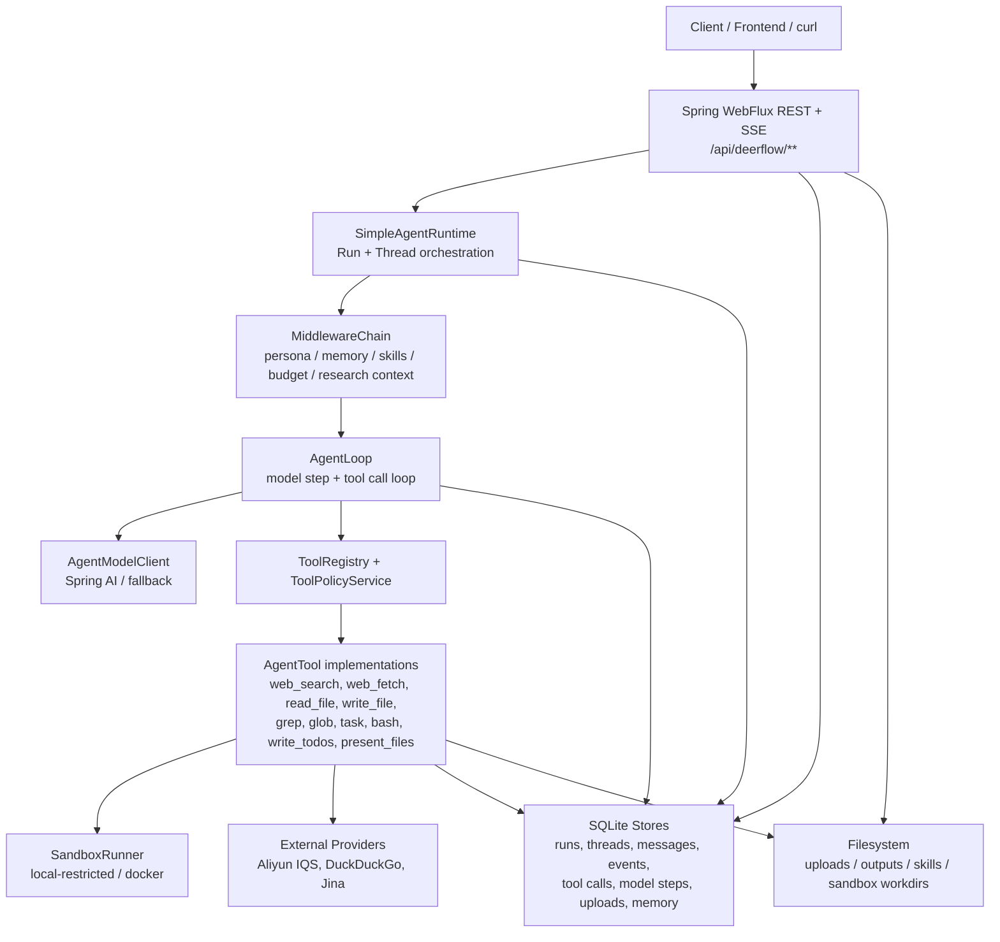

# haifa-ai-deerflow

`haifa-ai-deerflow` 是一个用 Java / Spring Boot 实现的 DeerFlow 风格 Agent Runtime。它把对话线程、SSE 流式运行、工具调用、深度研究、文件上传、产物生成、长期记忆、Persona、技能系统和 SQLite 持久化放在一个可本地运行的 WebFlux 服务中，作为 `deer-flow` Python 参考实现的 Java 探索版本。

当前模块不是完整生产版 DeerFlow，而是一个可运行、可测试、可继续演进的 Java Agent 后端。

## 功能概览

| 能力 | 说明 |
| --- | --- |
| 对话与运行 | 创建 thread/run，通过 SSE 返回 `RUN_STARTED`、`MODEL_*`、`TOOL_*`、`RUN_COMPLETED` 等事件 |
| 通用 Agent Loop | 模型可用 XML 风格 `<tool_call name="...">{...}</tool_call>` 调用工具，多轮执行直到 final answer |
| 深度研究模式 | 支持 `CHAT` / `RESEARCH` 两种模式，研究模式包含计划、搜索、抓取、证据、质量门禁与报告产物 |
| 工具系统 | 内置 workspace 文件工具、上传文件工具、web search/fetch、todo、task subagent、bash sandbox、present files、image/current time 等工具 |
| Skills | 从文件系统 / classpath 加载 Markdown skill，通过 slash skill 影响 prompt 和工具权限 |
| Tool Search | 支持 deferred tool catalog，按需暴露工具描述，减少一次性 prompt 膨胀 |
| Web Provider | 已注册 Aliyun IQS、DuckDuckGo Search、Jina Fetch 等 provider；配置决定实际 search/fetch 后端 |
| Sandbox Bash | 可选启用 `bash` 工具，支持 local-restricted 与 docker backend，带命令 allowlist、路径拒绝、超时、输出截断和审计 metadata |
| 文件上传 | 支持文本类文件上传、转换、查看、删除，并可在 run 中引用 uploaded file ids |
| 产物管理 | 研究报告 / 工具输出等产物写入 outputs，可通过 artifact API 预览和下载 |
| 记忆与 Persona | 支持 Persona 配置、memory facts、候选记忆审批 / 拒绝、运行后反思候选生成 |
| 持久化与审计 | 使用 SQLite + JPA 保存 threads、messages、runs、events、tool calls、tool executions、model steps、uploads、memory 等 |

## 架构图



## 核心模块

| 包 | 职责 |
| --- | --- |
| `agent` / `agent.loop` | Run 编排、Agent 事件、模型循环、工具调用解析、研究交付 |
| `middleware` | prompt 上下文控制、技能激活、工具输出预算、subagent 限流、Persona / memory 等 |
| `tool` | Agent 工具接口与内置工具实现 |
| `sandbox` | bash 命令执行后端、命令策略、Docker 路径映射 |
| `provider` | Web search / fetch provider SPI 与注册表 |
| `research` / `research.plan` | source/evidence、研究计划、进度、质量门禁 |
| `skill` | Markdown skill 加载、解析、渲染、slash resolver |
| `subagent` | `task` 工具委派的子 agent runtime |
| `upload` / `artifact` | 上传文件、转换内容、报告与产物管理 |
| `memory` | Persona、长期记忆 facts、候选记忆与反思 |
| `persistence` | SQLite JPA entity/repository/store/mapper |
| `web` | REST/SSE API controllers |

## 环境要求

- JDK 21+（本模块 Maven compiler 使用 release 21）
- Maven 3.x
- SQLite JDBC 由 Maven 依赖自动提供
- 可选：Docker，用于 `sandbox.backend=docker`
- 可选：OpenAI-compatible Spring AI 配置，用于真实模型调用
- 可选：Aliyun / DashScope、Jina 等 API key，用于搜索与抓取 provider

## 本地运行

从仓库根目录运行：

```bash
mvn -pl haifa-ai/haifa-ai-deerflow -am spring-boot:run
```

或者直接指定模块 POM：

```bash
mvn -f haifa-ai/haifa-ai-deerflow/pom.xml spring-boot:run
```

服务默认监听：

```text
http://localhost:8095
```

健康检查：

```bash
curl http://localhost:8095/api/deerflow/health
```

### 使用 OpenAI-compatible 模型

PowerShell 示例：

```powershell
$env:OPENAI_API_KEY = "your-key"
$env:OPENAI_BASE_URL = "https://api.openai.com"
$env:HAIFA_DEERFLOW_MODEL = "gpt-4o-mini"
mvn -Popenai -pl haifa-ai/haifa-ai-deerflow -am spring-boot:run
```

`openai` profile 会引入 `spring-ai-starter-model-openai`。如果没有配置真实模型，运行时会使用项目内的 fallback 行为，适合本地接口调试和测试。

### 配置 Web Search / Fetch

默认配置使用 Aliyun IQS：

```yaml
haifa:
  ai:
    deerflow:
      tools:
        web-search:
          provider: aliyun
          api-key: ${ALIYUN_API_KEY:${DASHSCOPE_API_KEY:}}
        web-fetch:
          provider: aliyun
          api-key: ${ALIYUN_API_KEY:${DASHSCOPE_API_KEY:}}
```

已注册的 provider：

| 工具 | 可用 provider |
| --- | --- |
| `web_search` | `aliyun`, `duckduckgo` |
| `web_fetch` | `aliyun`, `jina` |

示例：使用 DuckDuckGo + Jina，减少本地调试对 API key 的依赖：

```powershell
$env:HAIFA_AI_DEERFLOW_TOOLS_WEB_SEARCH_PROVIDER = "duckduckgo"
$env:HAIFA_AI_DEERFLOW_TOOLS_WEB_FETCH_PROVIDER = "jina"
mvn -pl haifa-ai/haifa-ai-deerflow -am spring-boot:run
```

### 启用 Bash Sandbox

`bash` 工具默认关闭。只在可信环境或 Docker 隔离下启用。

local-restricted 示例：

```powershell
$env:HAIFA_AI_DEERFLOW_BASH_ENABLED = "true"
$env:HAIFA_AI_DEERFLOW_SANDBOX_ENABLED = "true"
$env:HAIFA_AI_DEERFLOW_SANDBOX_BACKEND = "local"
mvn -pl haifa-ai/haifa-ai-deerflow -am spring-boot:run
```

注意：`local` backend 只是受限宿主机进程，metadata 会标记 `strongIsolation=false`。它会清空环境、设置唯一工作目录、执行命令策略，但不是强隔离。

Docker backend 示例：

```powershell
$env:HAIFA_AI_DEERFLOW_BASH_ENABLED = "true"
$env:HAIFA_AI_DEERFLOW_SANDBOX_ENABLED = "true"
$env:HAIFA_AI_DEERFLOW_SANDBOX_BACKEND = "docker"
$env:HAIFA_AI_DEERFLOW_SANDBOX_DOCKER_IMAGE = "ubuntu:24.04"
mvn -pl haifa-ai/haifa-ai-deerflow -am spring-boot:run
```

Docker backend 会把 workspace 只读挂载到 `/workspace`，把每次执行 the 唯一可写目录挂载到 `/sandbox`，并设置内存、CPU、进程数、只读根文件系统和网络策略。

### 启用脚本执行与本地观测 (run_script)

`run_script` 工具允许 Agent 在受控沙箱（Sandbox）内生成并执行脚本（支持 Python, PowerShell, Node.js, Bash），用于完成本地系统观测（例如 CPU 和内存使用率）、轻量计算、文件格式化及环境诊断等任务。

启用 `run_script` 所需的环境变量：

```powershell
$env:HAIFA_AI_DEERFLOW_RUN_SCRIPT_ENABLED = "true"
$env:HAIFA_AI_DEERFLOW_SANDBOX_ENABLED = "true"
$env:HAIFA_AI_DEERFLOW_SANDBOX_BACKEND = "local" # 或 "docker"
mvn -pl haifa-ai/haifa-ai-deerflow -am spring-boot:run
```

#### 安全与隔离说明

- **默认关闭**：`run_script` 默认处于关闭状态（`run-script-enabled=false`），必须显式配置才能开启。
- **允许的脚本语言**：可在配置项 `haifa.ai.deerflow.sandbox.allowed-script-languages`（默认值为 `python,powershell`）中精细化管控允许的解释器。
- **沙箱隔离等级**：
  - `local` backend 在宿主机执行子进程，元数据将标记 `strongIsolation=false`，属于受限隔离。
  - `docker` backend 在独立容器中运行（将只读挂载 `/workspace` 并挂载可写的 `/sandbox` 工作区目录），具备强隔离性。
- **路径及越界保护**：脚本文件会自动生成于临时工作区 `outputs/sandbox/{runId}/scripts/{randomId}/` 下，执行过程中的工作目录被锁定为该工作区，禁止访问工作区外部的绝对路径。
- **命令审计**：所有生成的脚本命令都会流经 `CommandPolicy` 策略服务进行合法性与安全性校验，执行过程审计保存在 `tool_executions` 审计日志中。

#### CPU/内存观测示例

通过发送包含本地观测关键字（如 `CPU`、`内存` 等）的请求，系统将自动激活 `local-script-execution` 技能并执行相关脚本：

```bash
curl -N -X POST http://localhost:8095/api/deerflow/runs/stream \
  -H "Content-Type: application/json" \
  -d '{"message":"查看下当前电脑 CPU 和内存使用率","mode":"CHAT"}'
```

常见问题排查：
- **工具关闭/沙箱未启用**：请确保 `run-script-enabled` 与 `sandbox.enabled` 均为 `true`。
- **Python 缺失第三方依赖**：如果在 Windows 的 local backend 下执行 Python 脚本，由于未安装 `psutil` 导致失败，Agent 会自动捕获 stderr 并在第二次尝试中自动切换为原生 PowerShell 脚本执行。
- **Docker 容器视角**：使用 docker backend 时，读取的指标为容器视角的 CPU/内存配额，而非宿主机真实的硬件使用率。

## API 使用示例

### Chat Run

```bash
curl -N -X POST http://localhost:8095/api/deerflow/runs/stream \
  -H "Content-Type: application/json" \
  -d '{"message":"List the workspace files, then explain what you saw","mode":"CHAT"}'
```

Windows `cmd.exe` 示例：

```bat
curl -N -X POST http://localhost:8095/api/deerflow/runs/stream ^
  -H "Content-Type: application/json" ^
  -d "{\"message\":\"List the workspace files, then explain what you saw\",\"mode\":\"CHAT\"}"
```

### Research Run

```bash
curl -N -X POST http://localhost:8095/api/deerflow/runs/stream \
  -H "Content-Type: application/json" \
  -d '{
    "message": "Research the current state of Java agent sandbox design and produce a concise report.",
    "mode": "RESEARCH",
    "researchOptions": {
      "depth": "STANDARD",
      "timeWindow": "LATEST",
      "maxSources": 8,
      "requireCitations": true,
      "outputFormat": "REPORT"
    }
  }'
```

### 上传文件并在 Run 中使用

```bash
curl -F "file=@notes.md" http://localhost:8095/api/deerflow/uploads
```

返回的 `fileId` 可以传给 run：

```bash
curl -N -X POST http://localhost:8095/api/deerflow/runs/stream \
  -H "Content-Type: application/json" \
  -d '{"message":"Summarize the uploaded file.","uploadedFileIds":["<fileId>"],"mode":"CHAT"}'
```

### 常用查询接口

| 接口 | 说明 |
| --- | --- |
| `GET /api/deerflow/health` | 健康状态、工具数、run/thread/message/upload 计数 |
| `POST /api/deerflow/runs/stream` | 创建并流式执行 run |
| `POST /api/deerflow/runs/{runId}/resume` | 在 clarification 已回答后恢复 run |
| `GET /api/deerflow/runs/{runId}` | 查询 run |
| `GET /api/deerflow/runs/{runId}/events` | 查询事件流历史 |
| `GET /api/deerflow/runs/{runId}/tool-executions` | 查询工具执行审计 |
| `GET /api/deerflow/runs/{runId}/tool-calls` | 查询模型工具调用 |
| `GET /api/deerflow/runs/{runId}/model-steps` | 查询模型步骤 |
| `GET /api/deerflow/runs/{runId}/sources` | 查询研究 sources |
| `GET /api/deerflow/runs/{runId}/evidence` | 查询研究 evidence |
| `GET /api/deerflow/runs/{runId}/plan` | 查询研究计划 |
| `GET /api/deerflow/runs/{runId}/progress` | 查询研究进度 |
| `GET /api/deerflow/runs/{runId}/quality-gate` | 查询研究质量门禁 |
| `POST /api/deerflow/threads` | 创建 thread |
| `GET /api/deerflow/threads` | 列出 threads |
| `GET /api/deerflow/threads/{threadId}/messages` | 查询 thread 消息 |
| `POST /api/deerflow/uploads` | 上传文件 |
| `GET /api/deerflow/uploads/{fileId}/content` | 查看上传文件转换后的文本 |
| `GET /api/deerflow/artifacts/{artifactId}/download` | 下载产物 |
| `GET /api/deerflow/persona` / `PUT /api/deerflow/persona` | 查询 / 更新 Persona |
| `GET /api/deerflow/memory/facts` | 查询长期记忆 |
| `GET /api/deerflow/memory/candidates` | 查询候选记忆 |

## 配置速查

| 配置 | 默认值 | 说明 |
| --- | --- | --- |
| `server.port` | `8095` | HTTP 端口 |
| `deerflow.persistence.sqlite.path` | `${user.dir}/data/deerflow.sqlite` | SQLite 数据库 |
| `haifa.ai.deerflow.model` | 空 | 默认模型名；也可每个 run 指定 |
| `haifa.ai.deerflow.workspace-root` | `${user.dir}` | workspace 文件工具根目录 |
| `haifa.ai.deerflow.skills-root` | `${user.dir}/skills` | 文件系统 skills 根目录 |
| `haifa.ai.deerflow.uploads-root` | `${user.dir}/uploads` | 上传文件目录 |
| `haifa.ai.deerflow.outputs-root` | `${user.dir}/outputs` | 报告、产物、sandbox 输出目录 |
| `haifa.ai.deerflow.max-upload-bytes` | `10485760` | 单文件上传大小上限 |
| `haifa.ai.deerflow.allowed-upload-extensions` | `txt,md,json,csv,log,xml,yml,yaml,properties` | 允许上传的扩展名 |
| `haifa.ai.deerflow.research-enabled` | `true` | 是否启用研究模式 |
| `haifa.ai.deerflow.max-research-steps` | `20` 类默认，`application.yml` 中覆盖为 `100` | 研究模式最大步骤 |
| `haifa.ai.deerflow.max-fetches-per-run` | `10` 类默认，`application.yml` 中覆盖为 `200` | 单 run 最大 fetch 数 |
| `haifa.ai.deerflow.write-file-enabled` | `true` | 是否启用写文件工具 |
| `haifa.ai.deerflow.str-replace-enabled` | `true` | 是否启用局部替换工具 |
| `haifa.ai.deerflow.bash-enabled` | `false` | 是否启用 bash 工具 |
| `haifa.ai.deerflow.sandbox.enabled` | `false` | 是否启用 bash sandbox |
| `haifa.ai.deerflow.sandbox.backend` | `local` | `local` 或 `docker` |
| `haifa.ai.deerflow.sandbox.network-enabled` | `false` | sandbox 命令是否允许网络 |

Spring Boot relaxed binding 支持用环境变量覆盖配置，例如：

```powershell
$env:HAIFA_AI_DEERFLOW_WORKSPACE_ROOT = "D:\workspace\haifa"
$env:HAIFA_AI_DEERFLOW_OUTPUTS_ROOT = "D:\workspace\haifa\outputs"
$env:DEERFLOW_PERSISTENCE_SQLITE_PATH = "D:\workspace\haifa\data\deerflow.sqlite"
```

## 构建、测试、打包

运行模块测试：

```bash
mvn -pl haifa-ai/haifa-ai-deerflow -am test
```

打包：

```bash
mvn -pl haifa-ai/haifa-ai-deerflow -am package
```

运行 jar：

```bash
java -jar haifa-ai/haifa-ai-deerflow/target/haifa-ai-deerflow-1.0-SNAPSHOT.jar
```

如果使用 OpenAI profile 打包：

```bash
mvn -Popenai -pl haifa-ai/haifa-ai-deerflow -am package
java -jar haifa-ai/haifa-ai-deerflow/target/haifa-ai-deerflow-1.0-SNAPSHOT.jar
```

## 部署建议

最小部署形态：

```text
JVM process
  -> Spring WebFlux API :8095
  -> SQLite file under data/
  -> uploads/ and outputs/ persistent volumes
  -> optional Docker daemon for sandbox backend
  -> optional external model/search/fetch providers
```

建议：

- 将 `data/`、`uploads/`、`outputs/` 挂载为持久化卷。
- 生产环境不要启用 `local` bash sandbox；需要命令执行时优先使用 `docker` backend。
- 对外暴露时在前面放置网关 / 反向代理，并保留 SSE 的 streaming 行为，避免代理缓冲。
- API key 使用环境变量或密钥管理，不要写入仓库配置。
- SQLite 适合本地和单实例部署；多实例或高并发场景应迁移到服务型数据库并补齐锁与迁移策略。

## 当前边界

- 这是 Java DeerFlow runtime 原型，不是完整 Python `deer-flow` 的等价实现。
- 部分 provider enum 已预留，但当前实际注册 bean 以 `application.yml` 注释和 provider registry 为准。
- local sandbox 不是强隔离；强隔离应使用 Docker 或未来 remote sandbox provider。
- Skills、subagent、memory、research 等能力仍在持续演进，接口和 metadata 可能继续调整。
