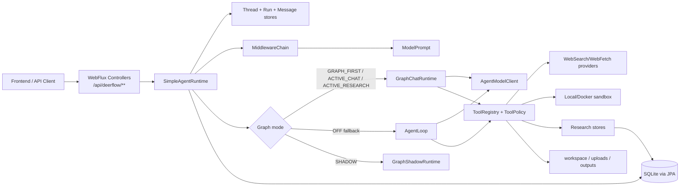

# haifa-ai-deerflow 架构说明

本文按当前代码事实维护，主要依据 `pom.xml`、`src/main/java` 和 `src/main/resources/application.yml`。历史设计文档或旧 pipeline 术语不作为事实来源。

## 模块定位

`haifa-ai-deerflow` 是一个 Java / Spring Boot WebFlux 实现的 DeerFlow 风格 Agent Runtime。它提供：

- `POST /api/deerflow/runs/stream` 的 SSE 运行接口。
- thread、run、message、event、model step、tool call、tool execution 等运行审计。
- Spring AI `ChatClient` 模型接入；未注入真实模型 provider 时使用 fallback model client。
- 统一的 agent loop / graph runtime，支持 chat 与 research 两类运行模式。
- 文件、上传文件、web search/fetch、image search、脚本、bash、todo、clarification、subagent、evidence/claim/citation 等工具。
- SQLite + JPA 持久化运行状态，文件系统持久化 uploads、outputs、skills 和 artifact registry。
- deep research 当前通过 `RunMode.RESEARCH`、`deep-research` skill、middleware、research observer、store 和工具链实现，不再依赖早期独立 pipeline UI 领域模型。

主类是 `org.wrj.haifa.ai.deerflow.DeerFlowApplication`。

## 总体结构

核心包职责：

| 包 | 代码职责 |
| --- | --- |
| `web` | REST/SSE 控制器，覆盖 runs、threads、uploads、artifacts、approvals、clarifications、memory/persona。 |
| `agent` / `agent.loop` | `SimpleAgentRuntime`、legacy `AgentLoop`、事件、请求、运行配置、final-answer/todo observer。 |
| `graph` / `graph.node` | `GraphChatRuntime`、`GraphResearchRuntime`、shadow graph、checkpoint、graph state、chat/research 节点。 |
| `middleware` | prompt 增强链：budget、skills、summary、dynamic context、persona、memory、clarification、thread memory、todo、tool error。 |
| `tool` | `AgentTool` 接口和内置工具实现。 |
| `provider` | web search/fetch provider SPI、registry 和启动时配置校验。 |
| `research` / `research.plan` | research plan、source/evidence、quality gate、progress、observer、report 支撑。 |
| `source` / `evidence` / `claim` / `work` / `quality` / `budget` | 当前 deep research 统一领域状态，主要通过 JPA store 持久化。 |
| `skill` | 文件系统 skill 解析、加载、slash skill 解析。 |
| `sandbox` | bash/run_script 的命令策略、local/docker runner。 |
| `artifact` / `upload` / `threadfile` | 上传文件、产物注册、thread 文件上下文。 |
| `memory` | persona、长期记忆 fact/candidate 和 run 后 reflection。 |
| `persistence` | JPA entity、repository、mapper、store、SQLite graph checkpoint。 |

## 启动与配置事实

当前 `application.yml` 的关键配置：

| 配置 | 当前 YAML 值 |
| --- | --- |
| HTTP 端口 | `server.port=8095` |
| Web 类型 | `spring.main.web-application-type=reactive` |
| SQLite | `jdbc:sqlite:${deerflow.persistence.sqlite.path}?journal_mode=WAL&busy_timeout=5000` |
| SQLite path | `${user.dir}/data/deerflow.sqlite` |
| Hikari pool | `maximum-pool-size=1`, `minimum-idle=1` |
| JPA ddl | `spring.jpa.hibernate.ddl-auto=update` |
| workspace | `${user.dir}/data/user-data/workspace` |
| uploads | `${user.dir}/data/user-data/uploads` |
| outputs | `${user.dir}/data/user-data/outputs` |
| skills root | `${user.dir}/skills` |
| Graph | `enabled=true`, `mode=GRAPH_FIRST`, `checkpoint.enabled=true` |
| Research | `enabled=true`, `max-research-steps=100`, `max-research-sources=100`, `max-fetches-per-run=200` |
| Tools | `write_file`、`str_replace`、`bash`、`run_script`、`tool_search` 当前 YAML 均开启 |
| Sandbox | `enabled=true`, `backend=local`, `network-enabled=true`, `run-script-local-unsafe-allowed=true` |
| Approval | 当前 YAML `enabled=false` |

需要区分代码默认值和 YAML 值：`DeerFlowProperties` 代码默认 `bashEnabled=false`、`runScriptEnabled=false`、`sandbox.enabled=false`、`approval.enabled=true`，但当前 YAML 明确打开本地脚本/网络 sandbox，并关闭 approval。因此按仓库 YAML 启动时，本地工具能力较开放，适合开发实验，不适合直接作为公网生产默认配置。

## HTTP API

主要控制器和路径来自 `web` 包：

| 能力 | 路径 |
| --- | --- |
| 健康检查 | `GET /api/deerflow/health` |
| 创建并流式运行 | `POST /api/deerflow/runs/stream` |
| 恢复 run | `POST /api/deerflow/runs/{runId}/resume` |
| run 查询 | `GET /api/deerflow/runs/{runId}` |
| run 明细 | `/events`, `/observability`, `/todos`, `/approvals`, `/tool-executions`, `/tool-calls`, `/model-steps`, `/activity`, `/skill-activations` |
| research 查询 | `/sources`, `/evidence`, `/plan`, `/progress`, `/quality-gate`, `/work-items`, `/claims`, `/citations`, `/quality`, `/budget` |
| threads | `POST/GET /api/deerflow/threads`, `GET/PATCH /api/deerflow/threads/{threadId}`, `/runs`, `/messages`, `/files`, `/recommend-questions` |
| uploads | `POST/GET /api/deerflow/uploads`, `GET/DELETE /api/deerflow/uploads/{fileId}`, `GET /content` |
| artifacts | `GET /api/deerflow/artifacts`, `GET /{artifactId}`, `/raw`, `/download` |
| approvals | `GET /api/deerflow/approvals/pending`, `/run/{runId}`, `/{approvalId}`, `/config`, `POST /{approvalId}/decision` |
| clarifications | `GET /api/deerflow/clarifications/pending`, `POST /api/deerflow/clarifications/{clarificationId}/answer` |
| memory/persona | `GET/PUT /api/deerflow/persona`, memory facts/candidates CRUD/approve/reject |

用户身份由 `X-User-Id` 解析，缺省为 `default-user`。

## Run 生命周期

`SimpleAgentRuntime` 是当前入口运行时：

1. 创建或复用 thread，创建 run，写入 USER message。
2. 组装 run metadata：mode、userId、上传文件数、research options、resume metadata 等。
3. research mode 自动激活 `deep-research` skill，并初始化 skill activation、budget ledger、quality assessment、thread file 等可用状态。
4. 通过 `MiddlewareChain` 生成 `ModelPrompt`。
5. 根据 graph 配置选择执行路径。
6. 运行中事件通过 `AgentEventStore`、`ModelStepStore`、`ToolCallStore`、`ToolExecutionStore` 等持久化。
7. 终态事件驱动 run 状态更新为 completed、failed、suspended 或 cancelled。
8. run 完成后可异步触发 `MemoryReflectionService.reflectAsync`。
9. research mode 完成后 `finishResearchDelivery` 会汇总 source/evidence/quality 信息，并在需要时通过 `ReportWriterService` 生成 Markdown artifact。

### Clarification resume

澄清恢复不是继续原 run，而是创建同 thread 下的新 run，并在 metadata 中写入：

- `resumedFromRunId`
- `clarificationId`
- `resumeType=clarification`

当前代码事实：

- `ClarificationMiddleware` 将已回答的澄清内容注入 prompt。
- USER message 保留原始任务文本，澄清答案不再替代原始任务。
- 新 run 会从 `resumedFromRunId` 继承父 run 的 TodoList，保持任务约束连续性。

## Graph 运行路径

`GraphRuntimeMode` 枚举包含：`OFF`、`SHADOW`、`GRAPH_FIRST`、`ACTIVE_CHAT`、`ACTIVE_RESEARCH`。

当前关键事实：

- `DeerFlowProperties.Graph` 默认 `enabled=true`、`mode=GRAPH_FIRST`。
- `SimpleAgentRuntime.shouldUseActiveChatGraph(...)` 对 chat 和 research 都可返回 true。
- `SimpleAgentRuntime.shouldUseActiveResearchGraph(...)` 当前直接返回 `false`。
- 因此，当前实际 active graph 路径以 `GraphChatRuntime` 为主；research mode 在 `GRAPH_FIRST` / `ACTIVE_RESEARCH` 下也走统一 chat graph，而不是直接进入 `GraphResearchRuntime`。
- `GraphResearchRuntime` 和 `ResearchAgentGraph` 仍存在于代码中，但目前不是 `SimpleAgentRuntime` 的 active research 执行入口。

### GraphChatRuntime

节点常量来自 `GraphChatRuntime`：

`load_context -> apply_prompt_middlewares -> call_model -> parse_model_output -> approval_gate -> clarification_gate -> execute_tools -> call_model ... -> final_answer_gate -> finalize`

主要行为：

- `ChatApplyMiddlewaresNode` 复用 middleware 产出的 prompt。
- `ChatCallModelNode` 使用 provider 结构化 `ModelResponse.toolCalls()`；graph 路径不再依赖手写 XML/Markdown 工具调用解析。
- `ChatExecuteToolsNode` 执行 tool registry 中的工具，并将成功、拒绝、未找到、失败统一转为 observation 写回 message window。
- `ChatFinalAnswerGateNode` 调用 loop observer 做 `shouldContinue` 和 final-answer gate。若同一拒绝指令重复出现 3 次，会以 metadata 标记强制终止，避免无限循环。
- `ChatFinalizeNode` 负责生成终态事件和 accepted final answer。

### ResearchAgentGraph

`ResearchAgentGraph` 当前定义了独立 research graph 节点：

`create_or_load_plan -> todo_sync -> dispatch_dimensions -> search_sources -> fetch_sources -> extract_evidence -> quality_gate -> replan -> verify_citations -> write_report`

但如上所述，当前 `SimpleAgentRuntime` 没有主动进入 `GraphResearchRuntime`，所以这条 graph 更像保留/实验性路径。文档和 UI 不应再把它当作当前 deep research 主流程的唯一来源。

## Deep Research 当前模型

当前 deep research 是统一 agent runtime 下的 research mode，而不是前端早期 pipeline 独立流程。代码上的组成：

- `RunMode.RESEARCH`：请求模式。
- `deep-research` skill：research mode 自动激活，并通过 skill/middleware 影响 prompt 和工具可见性。
- `TodoMiddleware` + `WriteTodosTool` + `DefaultAgentLoopObserver`：要求复杂任务维护 TodoList，final answer 前检查 Todo 完成度。
- `ResearchLoopObserver`：观察 web/search/fetch、evidence、claim、citation、quality 等事件，补齐研究状态。
- `ResearchPlanner` / `ResearchPlanStore` / `ResearchProgressTracker` / `ResearchQualityGate`：研究计划、任务、进度、质量门。
- `SourceStore`、`EvidenceItemStore`、`ClaimStore`、`CitationStore`、`BudgetLedgerStore`、`QualityAssessmentStore`、`ThreadFileStore`、`WorkItemStore`：统一 research domain state。
- `ReportWriterService` + `ArtifactService`：输出报告文件并注册 artifact。

UI 应围绕这些 run-scoped / thread-scoped 领域对象展示，而不是假设一个固定 pipeline 状态机一定按旧阶段推进。

## Prompt 中间件

`MiddlewareChain` 按 `@MiddlewareOrder` 排序。当前主要中间件：

| Order | 中间件 | 职责 |
| --- | --- | --- |
| 1 | `TokenBudgetMiddleware` | 基于字符/预估预算做输入限制。 |
| 5 | `SkillActivationMiddleware` | 注入 active skills。 |
| 8 | `SummarizationMiddleware` | 历史过长时摘要。 |
| 10 | `DynamicContextMiddleware` | 注入工作目录、outputs、日期等运行上下文。 |
| 12 | `PersonaMiddleware` | 注入当前用户 persona。 |
| 15 | `StructuredMemoryMiddleware` | 注入长期记忆 facts。 |
| 18 | `ClarificationMiddleware` | 阻止未回答澄清；resume 时注入澄清答案。 |
| 20 | `ThreadMemoryMiddleware` | research mode 下注入 thread 研究记忆、sources、evidence、artifacts。 |
| 25 | `TodoMiddleware` | 注入 TodoList 协议和当前 todo 状态。 |
| 30 | `ToolErrorHandlingMiddleware` | 注入工具错误处理要求。 |
| 50 | `ResearchPlanMiddleware` | research mode 下注入研究计划。 |

## 工具与安全边界

工具由 `ToolRegistry` 收集所有 `AgentTool` bean。当前内置工具覆盖：

- 文件/工作区：`ls`、`glob`、`grep`、`read_file`、`read_workspace_file`、`list_workspace_files`、`write_file`、`str_replace`、`present_files`。
- 上传文件：`list_uploaded_files`、`read_uploaded_file`。
- Web/媒体：`web_search`、`web_fetch`、`image_search`、`view_image`。
- 执行：`bash`、`run_script`。
- 协作与控制：`task`、`write_todos`、`ask_clarification`、`tool_search`、`current_time`。
- Research domain：`submit_evidence`、`submit_claim`、`submit_citation`。
- 测试/离线：`mock_search`、`mock_fetch`。

`ToolPolicyService` 根据全局配置、sandbox 状态、run mode 和 skill allowed tools 判断工具是否可见/可执行。`CommandPolicy` 对 bash/run_script 做命令 allowlist、deny pattern、路径越界和危险命令检查。

当前 YAML 中 approval 关闭，因此 `ApprovalPolicyService` 不会默认拦截高风险工具；若要用于共享环境，应显式打开 approval 或改用更强隔离的 docker sandbox。

## Web provider

当前注册实现：

| 类型 | 实现 |
| --- | --- |
| `web_search` | `aliyun`, `duckduckgo` |
| `web_fetch` | `aliyun`, `jina` |

`ProviderConfigurationValidator` 在应用启动时校验配置的 provider 是否有对应 bean；对需要 API key 的 provider，也会校验 key 是否存在。枚举里预留但未注册 bean 的 provider 不能直接配置使用。

## 持久化与文件状态

SQLite/JPA 主要表：

| 状态 | 表 |
| --- | --- |
| threads | `deerflow_threads` |
| runs | `deerflow_runs` |
| messages | `deerflow_messages` |
| events | `deerflow_events` |
| model steps | `deerflow_model_steps` |
| tool calls | `deerflow_tool_calls` |
| tool executions | `deerflow_tool_executions` |
| loop runs | `deerflow_agent_loop_runs` |
| uploads | `deerflow_uploads` |
| todos | `deerflow_todos` |
| clarifications | `deerflow_clarifications` |
| persona | `deerflow_personas` |
| memory facts/candidates | `deerflow_memory_facts`, `deerflow_memory_candidates` |
| research plans/tasks | `deerflow_research_plans`, `deerflow_research_tasks` |
| research sources/mappings | `deerflow_research_sources`, `deerflow_research_source_mappings` |
| legacy evidence | `deerflow_evidence_items` |
| graph checkpoints | `agent_graph_checkpoints`, `agent_graph_checkpoint_external_refs` |

其他状态：

- `ArtifactService` 将 artifact registry 保存在内存中，并同步到 `${userDataRoot}/artifacts.json`；artifact 文件必须位于 outputs root 下。
- uploads 文件内容保存在 uploads root，元数据在 SQLite。
- outputs 文件包括报告、工具外置输出、sandbox 脚本目录等。
- `ApprovalStore` 当前实现为内存 `ConcurrentHashMap`，重启后不保留 pending approval。
- `SQLiteResearchPlanStore` 是 `ResearchPlanStore` 的 `@Primary` 实现；`InMemoryResearchPlanStore` 仍存在但不是默认注入对象。

## 当前实现边界

- 当前默认是本地开发/实验配置：local sandbox、脚本执行、网络访问开启，approval 关闭。
- SQLite 使用 WAL、`busy_timeout=5000` 且 Hikari pool size 为 1，降低单进程并发写锁概率；多进程或多实例访问同一 SQLite 文件仍可能出现锁竞争。
- `GraphResearchRuntime` 存在但当前未被 `SimpleAgentRuntime` 作为 active research 入口调用。
- Deep research 观测质量依赖工具结果是否被正确沉淀到 source/evidence/claim/citation/quality stores；UI 中空字段通常应先按后端观测链路排查。
- `mcp-enabled` 有配置项，但当前主运行链路没有看到 MCP 工具接入实现。
- 本模块是 Java DeerFlow runtime 原型，不是 Python deer-flow 的等价完整实现。