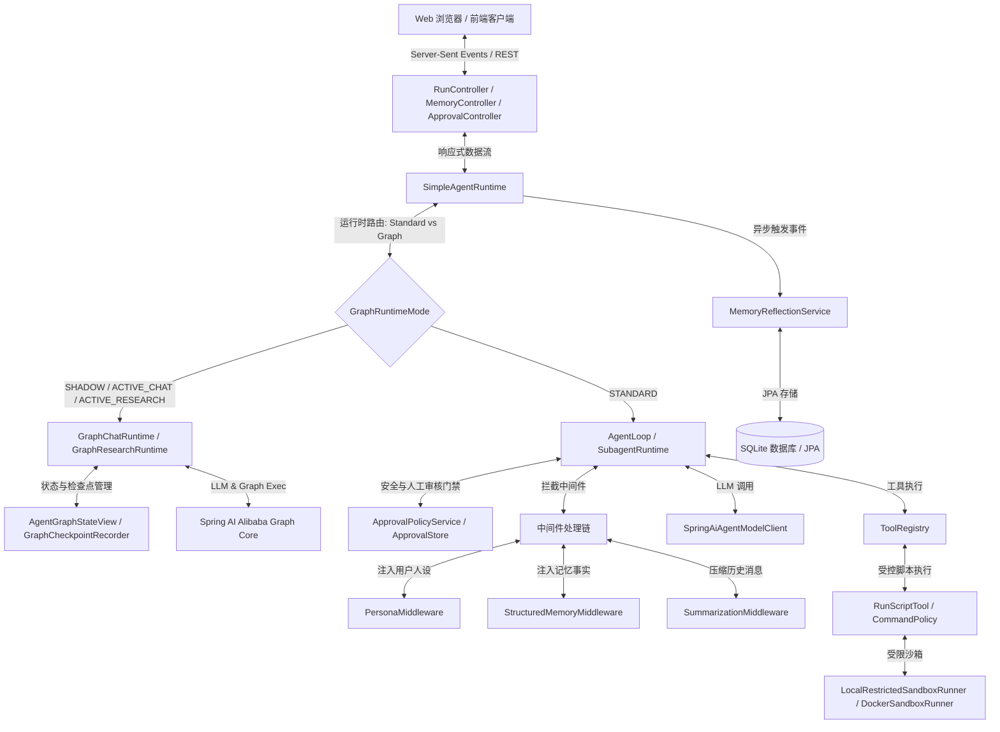
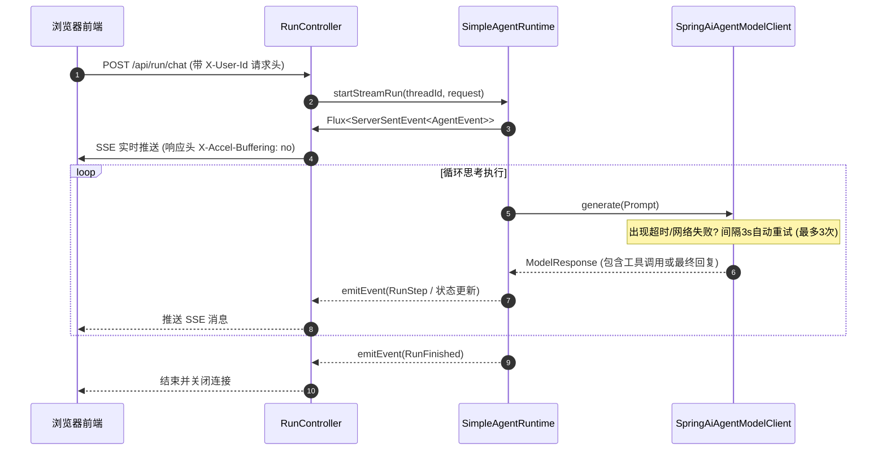
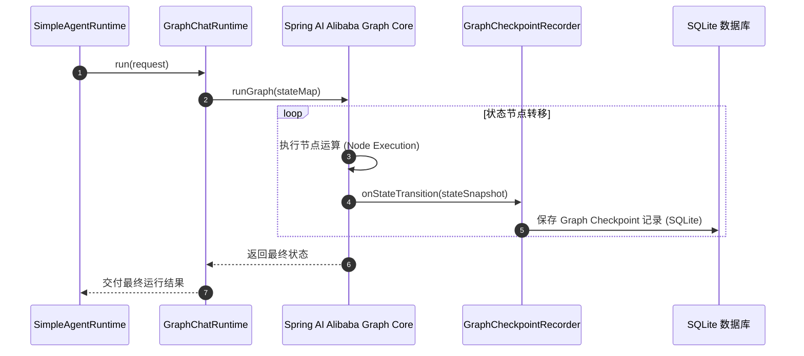
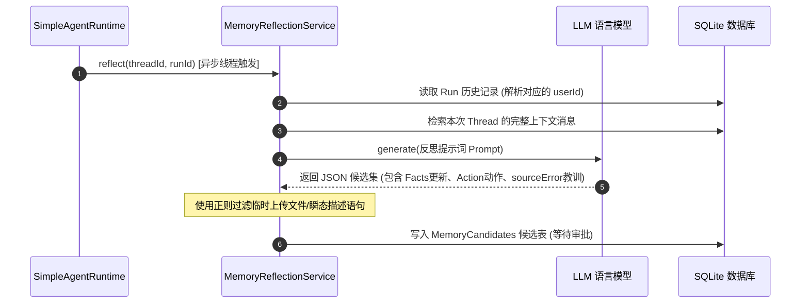

# Haifa-AI-DeerFlow 技术架构说明文档

本文档详细描述了 **haifa-ai-deerflow** 项目的设计理念、系统组件和核心数据流。该项目是一个轻量级的、基于 Spring Boot 的 Agent 框架，旨在支持响应式流式执行（Reactive Streaming）、多用户上下文隔离、动态人设规则（Persona）、受控沙箱脚本执行、人工审批协同（HITL）以及自动化的运行后内存反思（Memory Reflection）机制。

---

## 1. 高层架构概述

Haifa-AI-DeerFlow 采用响应式、事件驱动的模型，将 Agent 的运行时执行与前端 API 交互层进行了解耦。后端技术栈主要基于 Spring Boot (Spring WebFlux)、Spring Data JPA 以及 Project Reactor。系统内置了多种运行时组件，可根据配置在标准 Agent 循环与基于 Graph 的状态流图引擎之间灵活路由。

下图展示了系统的高层组件及其交互关系：



---

## 2. 核心组件说明

### 2.1 API 与 Web 交互层
*   **RunController**：对外暴露 REST 接口以启动对话流（`/api/run/chat`）和研究流（`/api/run/research`），并支持在 Run 挂起（例如 Clarification 或 Approval 待处理）时恢复运行（`/api/runs/{runId}/resume`）。
*   **MemoryController**：提供关于记忆事实（Facts）、人设记录（Personas）的管理入口，并处理对提取出来的记忆候选（Memory Candidates）的审核与批准操作（`/api/memory/*`）。
*   **ApprovalController**：提供人工审批决策 API（`/api/deerflow/approvals/**`），支持获取待处理审批、对具体高风险动作进行 `APPROVE` 或 `DENY` 决策。
*   **UserIdResolver**：从 HTTP 请求头的 `X-User-Id` 字段中解析出用户 ID。如果不存在，则默认为 `"default-user"`，以确保严格的多租户用户级别数据隔离。

### 2.2 运行时引擎与路由 (Runtime Engine & Routing)
*   **SimpleAgentRuntime**：管理 Run 记录的完整生命周期。它根据 `haifa.ai.deerflow.graph.mode` 配置将执行流分流路由给标准模式或 Graph 静态流图模式：
    *   **STANDARD**：拉起主 `AgentLoop` 通过 Reactor 流式调度派发。
    *   **ACTIVE_CHAT / ACTIVE_RESEARCH**：委托给 Graph 运行时执行，并在流式响应中输出结果。
    *   **SHADOW**：标准模式执行，同时启动影子图并行分析。
*   **AgentLoop**：控制 Agent 的思考/执行循环，在单次循环中决定是否调用外部 Tool、发起 LLM 交互，并判断是否满足终止条件。

### 2.3 Graph 运行时与状态适配 (Graph Runtime & State Adapters)
*   **GraphChatRuntime & GraphResearchRuntime**：对接 `spring-ai-alibaba-graph-core` 实现的流图运行适配器。
*   **AgentGraphStateView**：封装图的动态状态属性（如消息窗口大小、任务待办队列等），将状态图数据在底层的 Map 表示与结构化视图之间做适配映射。
*   **GraphCheckpointRecorder & AgentGraphCheckpointStore**：在每次 Graph 流图状态转换完毕时，将最新的图状态实体（Checkpoint Entity）以及状态 JSON 快照保存至 SQLite 数据库中，支持历史回溯。

### 2.4 人工审核门禁 (Human-in-the-Loop Approval Gate)
*   **ApprovalPolicyService**：在 Agent 执行命令前进行高风险动作判定。例如对 `run_script`（或开启的 `bash`）工具，它会拦截并将其判定为高危操作，输出 `AWAITING_APPROVAL`。
*   **AgentApprovalStore**：对审批请求实体进行持久化管理，记录审批上下文（风险原因、动作参数、状态等）。
*   **Approval Gate (AgentLoop Integration)**：在执行被拦截的高风险动作时，AgentLoop 将中止当前的 execution pipeline，将 Run 标记为 `AWAITING_APPROVAL`，并发送 `APPROVAL_NEEDED` 事件。当用户做完审批决策并调用 `resume` 时恢复执行。

### 2.5 受控脚本执行与沙箱 (RunScriptTool & Sandbox)
*   **RunScriptTool & CommandPolicy**：允许 Agent 编写 Python、Powershell、Node.js、Bash 脚本执行，并通过安全策略引擎（CommandPolicy）进行敏感路径屏蔽、反 shell 操作拼接、以及特殊 shell 符号阻断审计。
*   **SandboxRunner**：
    *   `LocalRestrictedSandboxRunner`：清空环境、只保留受限 PATH、限制临时工作目录，跨平台处理 Windows Powershell 与 Unix-like shell 脚本调起。
    *   `DockerSandboxRunner`：提供高强度容器隔离，workspace 只读绑定挂载，临时工作区独占可写挂载，并施加 CPU、内存、PIDs 等硬件限制。

### 2.6 中间件过滤链 (Middleware Chain)
在 Agent 组装发送给 LLM 的 System Prompt 前，Prompt 会依次流经拦截器链：
1.  **PersonaMiddleware**：识别当前用户的激活人设，将人设灵魂规则（Soul Rules）包裹在 `<persona-identity-and-style-only>` 标签中注入 Prompt，并追加开发者安全防护规则，以防人设被提示词注入攻击破坏。
2.  **StructuredMemoryMiddleware**：从数据库读取当前用户在 `active` 状态下的长期记忆事实（如用户偏好、开发规范等），动态拼接并注入系统 Prompt。
3.  **SummarizationMiddleware**：当上下文消息长度超出 Token 预算时，自动对历史对话进行总结和压缩。

### 2.7 记忆反思与审核系统 (Memory Reflection System)
*   **MemoryReflectionService**：在会话运行结束（Run Finished）时被异步触发。
    *   **大模型提取**：使用特定的 Prompt 让大模型总结本次对话，提炼出事实更新信息、待执行动作（`ADD`、`UPDATE`、`ARCHIVE`）以及历史犯错教训（`sourceError`）。
    *   **噪音清洗**：在保存之前，使用正则过滤器 `UPLOAD_SENTENCE_RE` 清洗掉类似于“用户上传了 XXX 文件”等只在单次会话有效的瞬态噪音事实。
    *   **人工审核**：提炼的记忆作为 `MemoryCandidateEntity` 写入数据库等待用户在前端审批。在 `MemoryController` 审批通过时，系统会与已有的 Active Facts 进行去重（Trim 及大小写归一化匹配），避免重复写入。

---

## 3. 核心数据流

### 3.1 响应式流式执行流程 (SSE Stream)


### 3.2 人工审核干预流 (HITL Approval Gate Flow)
```mermaid
sequenceDiagram
    autonumber
    participant LLM as LLM 语言模型
    participant Loop as AgentLoop
    participant Policy as ApprovalPolicyService
    participant Store as AgentApprovalStore
    participant Front as 浏览器前端
    participant Controller as ApprovalController
    
    Loop->>LLM: generate(Prompt)
    LLM-->>Loop: 返回 ToolCall: run_script(language="python", code="...")
    Loop->>Policy: evaluateToolCall("run_script", arguments)
    Policy-->>Loop: Decision: REQUIRE_APPROVAL
    Loop->>Store: createApprovalRequest(runId, toolCallDetails)
    Store-->>Loop: 返回 approvalId
    Loop-->>Front: 流式推送 SSE: AgentEvent (type=APPROVAL_NEEDED, content=approvalId)
    Note over Loop: Run 进入 AWAITING_APPROVAL 状态，暂停执行
    
    Front->>Controller: POST /api/deerflow/approvals/{approvalId}/decision {"decision":"APPROVE"}
    Controller->>Store: updateStatus(approvalId, APPROVED)
    Front->>Controller: POST /api/deerflow/runs/{runId}/resume
    Controller->>Loop: resume()
    Note over Loop: 恢复运行，继续执行 run_script 工具并获取输出
```

### 3.3 Graph 运行时流图状态更新与 Checkpoint 流程


### 3.4 异步长期记忆反思流程


---

## 4. 关键设计决策

1.  **基于 HTTP 请求头的租户级隔离**：系统没有将当前用户标识维护在全局有状态组件中，而是要求所有 API 端点显式解析 `X-User-Id` 头，将用户作用域（User Scope）贯穿整个响应式调用链与异步反射线程，彻底避免了多租户场景下的数据越权访问。
2.  **“提取-审核-落库”记忆审批模型**：相比自动写入的记忆模型，Haifa 采用了“LLM 反思提取 -> 写入 Candidate 候选区 -> 用户手工 Approve”的安全决策环。这把控了生成事实的准确性，防止幻觉噪音污染 Agent 系统。
3.  **基于 SQLite 持久化层替代 H2/文件树**：系统现将所有 thread、messages、memory facts、candidates、approvals 以及 graph checkpoints 统一存储至 SQLite 数据库中。这提供了轻量级、零服务器依赖的关系型持久化基础，利于本地测试部署。
4.  **静态 Graph 引擎与 Agent Loop 协作路由**：引入了 Graph Core 流图引擎，但保留了标准 Agent Loop。通过模式配置（`haifa.ai.deerflow.graph.mode`），开发者可以控制对话/研究使用动态的多轮 Agent 决策循环，还是使用严密而结构化的静态 Graph 节点流图，甚至使用 Shadow 模式对比两者结果，为运行时提供高度的灵活性。
