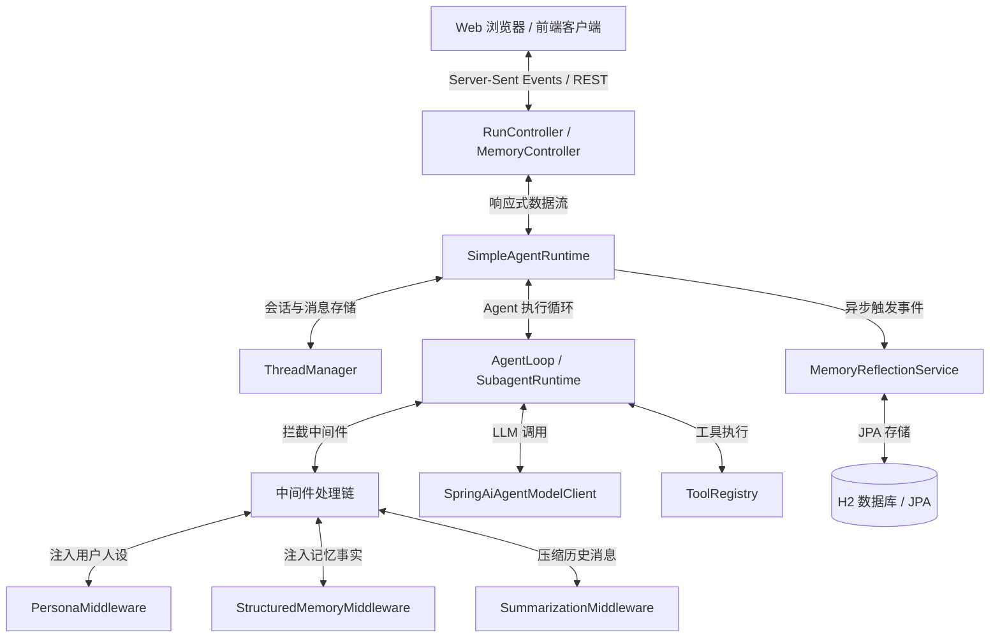
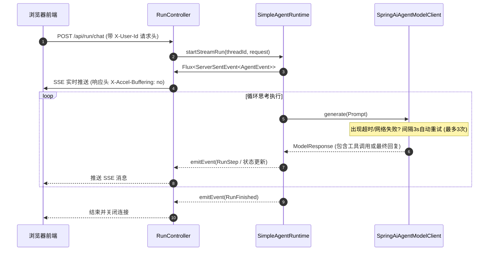
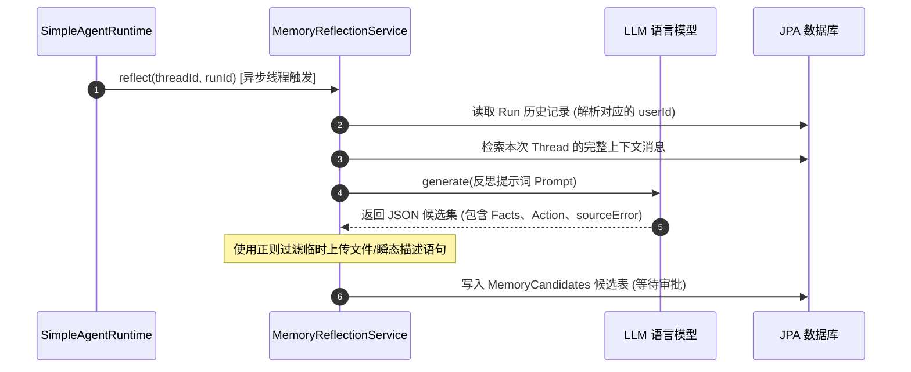

# Haifa-AI-DeerFlow 技术架构说明文档

本文档详细描述了 **haifa-ai-deerflow** 项目的设计理念、系统组件和核心数据流。该项目是一个轻量级的、基于 Spring Boot 的 Agent 框架，旨在支持响应式流式执行（Reactive Streaming）、多用户上下文隔离、动态人设规则（Persona）以及自动化的运行后内存反思（Memory Reflection）机制。

---

## 1. 高层架构概述

Haifa-AI-DeerFlow 采用响应式、事件驱动的模型，将 Agent 的运行时执行与前端 API 交互层进行了解耦。后端技术栈主要基于 Spring Boot (Spring WebFlux)、Spring Data JPA 以及 Project Reactor。

下图展示了系统的高层组件及其交互关系：

---

## 2. 核心组件说明

### 2.1 API 与 Web 交互层
*   **RunController**：对外暴露 REST 接口以启动对话流（`/api/run/chat`）和研究流（`/api/run/research`）。该层采用 Server-Sent Events (SSE) 协议将执行日志与中间状态实时推送给前端。
*   **MemoryController**：提供关于记忆事实（Facts）、人设记录（Personas）的管理入口，并处理对提取出来的记忆候选（Memory Candidates）的审核与批准操作（`/api/memory/*`）。
*   **UserIdResolver**：从 HTTP 请求头的 `X-User-Id` 字段中解析出用户 ID。如果不存在，则默认为 `"default-user"`，以确保严格的多租户用户级别数据隔离。

### 2.2 运行时引擎 (Runtime Engine)
*   **SimpleAgentRuntime**：管理 Run 记录的完整生命周期。它负责初始化对话线程、拉起主 `AgentLoop` 或 `SubagentRuntime` 并在 Project Reactor 的流式调度中将底层的 `AgentEvent` 实时派发给 WebFlux 的 Event Emitter。
*   **AgentLoop**：控制 Agent 的思考/执行循环，在单次循环中决定是否调用外部 Tool、发起 LLM 交互，并判断是否满足终止条件。

### 2.3 模型客户端适配器 (Model Client Adapter)
*   **SpringAiAgentModelClient**：基于 Spring AI 对接底层大语言模型服务。它内置了网络连接与读取超时的控制参数。
    *   **重试机制**：集成响应式重试逻辑 `Retry.fixedDelay(3, Duration.ofSeconds(3))`，当遇到网络连接中断或读取超时（例如 Netty 的 `ReadTimeoutException`）时，会自动进行最多 3 次重试（每次间隔 3 秒），并在重试用尽后通过 `.onRetryExhaustedThrow` 向上抛出原始根因异常以方便排查。

### 2.4 中间件过滤链 (Middleware Chain)
在 Agent 组装发送给 LLM 的 System Prompt 前，Prompt 会依次流经拦截器链：
1.  **PersonaMiddleware**：识别当前用户的激活人设，将人设灵魂规则（Soul Rules）包裹在 `<persona-identity-and-style-only>` 标签中注入 Prompt，并追加开发者安全防护规则，以防人设被提示词注入攻击破坏。
2.  **StructuredMemoryMiddleware**：从数据库读取当前用户在 `active` 状态下的长期记忆事实（如用户偏好、开发规范等），动态拼接并注入系统 Prompt。
3.  **SummarizationMiddleware**：当上下文消息长度超出 Token 预算时，自动对历史对话进行总结和压缩。

### 2.5 记忆反思与审核系统 (Memory Reflection System)
*   **MemoryReflectionService**：在会话运行结束（Run Finished）时被异步触发。
    *   **大模型提取**：使用特定的 Prompt 让大模型总结本次对话，提炼出事实更新信息、待执行动作（`ADD`、`UPDATE`、`ARCHIVE`）以及历史犯错教训（`sourceError`）。
    *   **噪音清洗**：在保存之前，使用正则过滤器 `UPLOAD_SENTENCE_RE` 清洗掉类似于“用户上传了 XXX 文件”等只在单次会话有效的瞬态噪音事实。
    *   **人工审核**：提炼的记忆作为 `MemoryCandidateEntity` 写入数据库等待用户在前端审批。在 `MemoryController` 审批通过时，系统会与已有的 Active Facts 进行去重（Trim 及大小写归一化匹配），避免重复写入。

---

## 3. 核心数据流

### 3.1 响应式流式执行流程 (SSE Stream)

### 3.2 异步长期记忆反思流程

---

## 4. 关键设计决策

1.  **基于 HTTP 请求头的租户级隔离**：系统没有将当前用户标识维护在全局有状态组件中，而是要求所有 API 端点显式解析 `X-User-Id` 头，将用户作用域（User Scope）贯穿整个响应式调用链与异步反射线程，彻底避免了多租户场景下的数据越权访问。
2.  **“提取-审核-落库”记忆审批模型**：相比自动写入的记忆模型，Haifa 采用了“LLM 反思提取 -> 写入 Candidate 候选区 -> 用户手工 Approve”的安全决策环。这把控了生成事实的准确性，防止幻觉噪音污染 Agent 系统。
3.  **基于关系型 Schema (JPA/H2) 替代文件树**：系统使用标准 JPA 实体对事实和人设进行建模，而不是采用扁平的 JSON 文件存储。这带来了结构化索引、条件分页检索、防重过滤以及原生数据库级别并发事务的天然保障。
