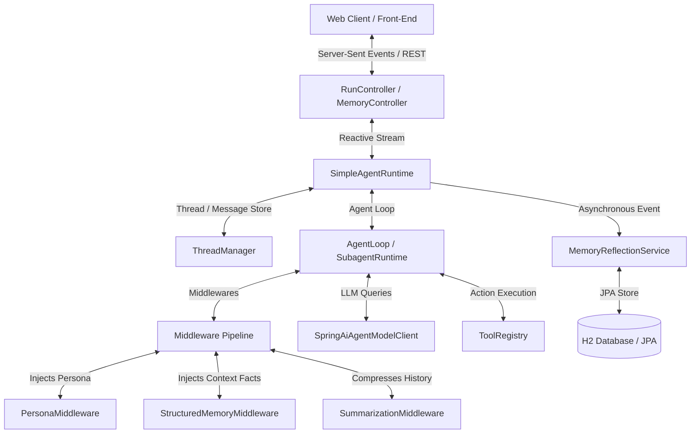
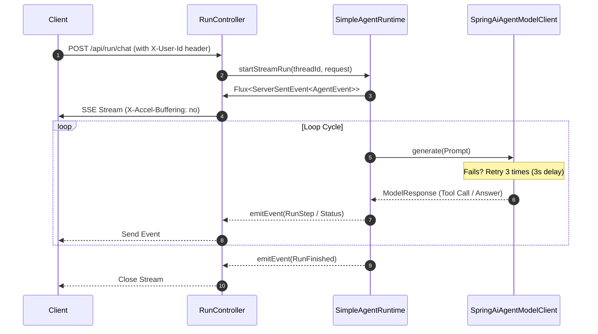
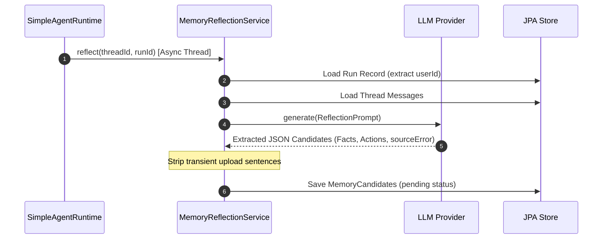

# Haifa-AI-DeerFlow Technical Architecture

This document describes the design, system components, and data flows of the **haifa-ai-deerflow** project. It is a lightweight, Spring Boot-based agent framework built to support reactive streaming execution, multi-user context isolation, dynamic agent persona rules, and automatic post-run memory reflection.

---

## 1. High-Level Architecture Overview

Haifa-AI-DeerFlow separates the runtime execution of agents from front-end API layers using a reactive, event-driven pattern. The backend is powered by Spring Boot (Spring WebFlux), Spring Data JPA, and Project Reactor.

The diagram below shows the high-level components and their interactions:

---

## 2. Key Components

### 2.1 API & Web Layer
*   **RunController**: Exposes REST interfaces to initiate chat runs (`/api/run/chat`) and research runs (`/api/run/research`). It streams execution events back to the client using Server-Sent Events (SSE).
*   **MemoryController**: Provides endpoints for managing memory facts, persona records, and reviewing/approving memory candidates (`/api/memory/*`).
*   **UserIdResolver**: Extracts the `X-User-Id` HTTP header from request exchanges to guarantee strict user isolation. Defaults to `"default-user"` if not present.

### 2.2 Runtime Engine
*   **SimpleAgentRuntime**: Manages the life cycle of a run. It loads the chat thread, spins up the main `AgentLoop` or `SubagentRuntime`, manages state transitions, and pushes reactive `AgentEvent`s to the WebFlux event emitter.
*   **AgentLoop**: Evaluates user prompts in cycles, invoking tools, calling the model client, and checking final stop conditions.

### 2.3 Model & Client Adapter
*   **SpringAiAgentModelClient**: Integrates with the LLM via Spring AI. It configures connection and read timeouts.
    *   **Retry Mechanism**: Incorporates a reactive retry operator: `Retry.fixedDelay(3, Duration.ofSeconds(3))` with `onRetryExhaustedThrow` to retry model calls up to 3 times with 3-second delay on timeouts and connection failures before terminating.

### 2.4 Middleware Chain
When the agent prepares a model prompt, it passes it through a chain of interceptors:
1.  **PersonaMiddleware**: Inspects the user's active Persona for the context. It wraps persona soul rules in `<persona-identity-and-style-only>` tags and appends developer safety guardrails to ensure output safety.
2.  **StructuredMemoryMiddleware**: Queries active memory facts (e.g. user preferences, coding standards) for the user scope and prepends them to the system prompt.
3.  **SummarizationMiddleware**: Condenses message history if it exceeds context budget.

### 2.5 Memory & Reflection System
*   **MemoryReflectionService**: Asynchronously triggered after a run finishes.
    *   **LLM Extraction**: Instructs the model to review the thread history and extract memory facts, actions (`ADD`, `UPDATE`, `ARCHIVE`), and any prior wrong approaches (`sourceError`).
    *   **Sanitization**: Strips out transient session-specific descriptions (e.g., file paths, upload summaries) using `UPLOAD_SENTENCE_RE` to maintain a clean fact candidate list.
    *   **Review & Approval**: Candidates are stored in `MemoryCandidateEntity` for manual user approval. Upon approval in `MemoryController`, active facts are updated/archived, and new facts are deduplicated against existing records.

---

## 3. Core Data Flow

### 3.1 Reactive Streaming Execution (SSE)

### 3.2 Asynchronous Memory Reflection Flow

---

## 4. Key Design Decisions

1.  **Strict HTTP User Scope Mapping**: Rather than managing user context as global states, all resources (Threads, Runs, Personas, Facts, Candidates) are strictly scoped and checked against a `userId` resolved from request-level headers, preventing resource leakages in multi-tenant environments.
2.  **Explicit Memory Approval Model**: Unlike systems that automatically write all extractions directly to the memory index, Haifa implements an "extraction -> review candidate -> manual approval" cycle. This gives users absolute control over what details are injected into future prompts.
3.  **H2 Database Persistence over JSON Trees**: While flat-file JSON formats are simpler, using a relational schema (represented by JPA entities mapping to H2 memory databases) allows structured SQL queries, pagination, transactional safety, and robust relationships between candidate records and active memory facts.
