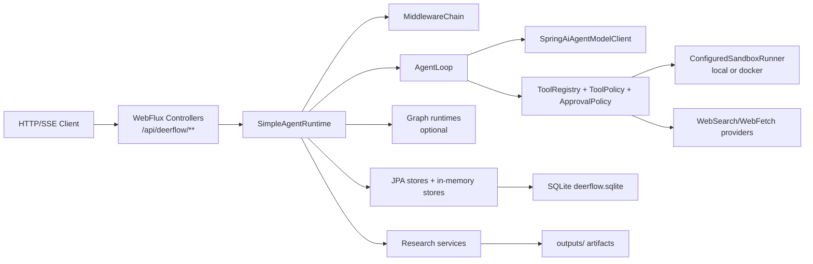

# haifa-ai-deerflow 架构说明

本文依据当前代码重写，事实来源限定为本模块的 `pom.xml`、`src/main/java` 和 `src/main/resources/application.yml`。旧文档内容不作为依据。

## 模块定位

`haifa-ai-deerflow` 是一个基于 Spring Boot WebFlux 的最小 DeerFlow Java 运行时。它提供：

- SSE 形式的 Agent Run 流式执行接口。
- 基于 Spring AI `ChatClient` 的模型调用，工具调用由本运行时解析和执行。
- 本地文件、上传文件、Web Search/Fetch、脚本执行、子 Agent、Todo、澄清和审批等工具。
- 研究模式的计划、搜索、抓取、证据抽取、质量门和 Markdown 报告产物。
- SQLite/JPA 持久化线程、运行、消息、事件、模型步骤、工具调用、上传和长期记忆。
- 可选的 Alibaba Spring AI Graph 路径，用于 chat/research 主动执行或 chat shadow 执行。

当前模块 artifact 为 `haifa-ai-deerflow`。主类是 `org.wrj.haifa.ai.deerflow.DeerFlowApplication`。

## 总体结构

核心包职责：

- `web`: REST/SSE 控制器。
- `agent`: 运行时、模型循环、事件、请求和运行配置。
- `model`: Spring AI 模型客户端、提示和工具调用解析。
- `tool`: 内置工具、工具注册和工具策略。
- `sandbox`: 命令策略、本地/Docker 沙箱执行。
- `graph`: Alibaba Spring AI Graph 的 chat/research/shadow 运行时和 checkpoint。
- `research`: 研究计划、来源、证据、质量门、引用和研究事件支持。
- `middleware`: prompt 构建、技能、摘要、persona、记忆、todo 等中间件。
- `skill`: 文件系统技能加载和 slash/activation-hint 激活。
- `persistence`: JPA entity、repository、store 和 SQLite checkpoint store。
- `memory`: persona、长期记忆事实、候选记忆和异步 reflection。
- `upload`, `artifact`, `approval`, `todo`, `subagent`: 对应能力的运行时组件。

## 启动与配置事实

默认配置在 `src/main/resources/application.yml`：

- HTTP 端口：`8095`。
- Web 类型：`reactive`。
- SQLite 路径：`${user.dir}/data/deerflow.sqlite`。
- workspace：`${HAIFA_DEERFLOW_WORKSPACE:${user.dir}}`。
- skills root：`${HAIFA_DEERFLOW_SKILLS:${user.dir}/skills}`。
- 上传目录：`${user.dir}/uploads`，默认允许 `txt,md,json,csv,log,xml,yml,yaml,properties,docx`，最大 10 MB。
- 输出目录由 `DeerFlowProperties` 的 `outputsRoot` 管理，默认 `${user.dir}/outputs`。
- 研究默认开启，默认深度 `STANDARD`，配置中 `max-research-steps=100`、`max-research-sources=100`、`max-fetches-per-run=200`。
- Web Search/Fetch 默认 provider 都是 `aliyun`，API key 读取 `ALIYUN_API_KEY` 或 `DASHSCOPE_API_KEY`。
- Graph 默认未开启，`mode=off`，checkpoint 默认未开启。

需要特别区分代码默认值和当前 YAML：

- `DeerFlowProperties` 代码默认 `bashEnabled=false`、`runScriptEnabled=false`、`sandbox.enabled=false`、`approval.enabled=true`。
- 当前 `application.yml` 将 `bash-enabled=true`、`run-script-enabled=true`、`sandbox.enabled=true`、`sandbox.backend=local`、`sandbox.network-enabled=true`、`run-script-local-unsafe-allowed=true`，并将 `approval.enabled=false`。
- 因此按当前 YAML 启动时，本地脚本执行和网络访问是打开的，审批保护是关闭的；生产或共享环境应显式覆盖这些配置。

模型侧通过 Spring AI 注入 `ChatClient.Builder`。如果没有可用的 Spring AI 模型 provider，`SpringAiAgentModelClient` 会返回一段 fallback 文本而不是执行真实模型调用。`openai` Maven profile 会引入 OpenAI starter；YAML 中 OpenAI API key、base url 和 model 都通过环境变量占位。

## HTTP API

所有接口位于 `web` 包，用户身份由 `X-User-Id` 解析，缺省为 `default-user`。

主要接口：

- `GET /api/deerflow/health`: 健康检查和配置摘要。
- `POST /api/deerflow/runs/stream`: 创建 run 并以 `text/event-stream` 返回 Agent 事件。
- `POST /api/deerflow/runs/{runId}/resume`: 恢复澄清或审批挂起的 run，并继续 SSE。
- `GET /api/deerflow/runs/{runId}` 以及 `/events`、`/approvals`、`/tool-executions`、`/tool-calls`、`/model-steps`。
- `GET /api/deerflow/runs/{runId}/sources`、`/evidence`、`/plan`、`/progress`、`/quality-gate`: 研究运行查询。
- `POST /api/deerflow/threads`，`GET /api/deerflow/threads`，`GET/PATCH /api/deerflow/threads/{threadId}`，以及线程下 runs/messages 查询。
- `POST /api/deerflow/uploads`，`GET /api/deerflow/uploads`，`GET /api/deerflow/uploads/{fileId}`，`GET /content`，`DELETE`。
- `GET /api/deerflow/artifacts`，`GET /api/deerflow/artifacts/{artifactId}`，`GET /download`。
- `GET /api/deerflow/approvals/pending`，`GET /api/deerflow/approvals/run/{runId}`，`POST /api/deerflow/approvals/{approvalId}/decision`。
- `GET /api/deerflow/clarifications/pending`，`POST /api/deerflow/clarifications/{clarificationId}/answer`。
- `GET/PUT /api/deerflow/persona`。
- `GET/POST/PATCH/DELETE /api/deerflow/memory/facts`。
- `GET /api/deerflow/memory/candidates`，`POST /approve`，`POST /reject`。

## Run 生命周期

`SimpleAgentRuntime` 是当前主运行时：

1. 接收 `AgentRequest`，创建或复用 thread，创建 run，并持久化用户消息。
2. 根据请求和配置生成 `AgentRunConfig`，包括 runId、threadId、model、workspace、run mode、研究配置和 userId。
3. 发出 `RUN_STARTED`。
4. 解析 active skills：支持 `/skill-name`，也支持 skill 的 activation hints；研究模式会自动尝试加入 `deep-research`。
5. 通过 `MiddlewareChain` 构造最终 `ModelPrompt`。
6. 根据 Graph 配置选择执行路径：
   - `ACTIVE_CHAT` 且 chat mode：走 `GraphChatRuntime`。
   - `ACTIVE_RESEARCH` 且 research mode：走 `GraphResearchRuntime`。
   - 否则走普通 `AgentLoop`；如果 Graph 是 `SHADOW`，chat 会并行触发 shadow graph，但主结果仍来自 `AgentLoop`。
7. 根据终态事件更新 run 状态：completed、failed、suspended 或 cancelled。
8. 完成后异步触发 `MemoryReflectionService.reflectAsync`，抽取长期记忆候选。
9. 研究模式完成后由 `ReportWriterService` 生成 Markdown 报告并注册 artifact，同时发出 `REPORT_*` 和 `ARTIFACT_CREATED` 事件。

核心事件类型定义在 `AgentEventType`，覆盖 run、模型、工具、研究、质量门、报告、子 Agent、Todo、澄清和审批。

## AgentLoop

`AgentLoop` 是非 Graph 路径的核心循环：

- 每步调用 `AgentModelClient.generate`。
- 工具以 Spring AI structured tool-call 形式暴露给模型，但 `internalToolExecutionEnabled(false)`，实际执行由本运行时完成。
- 如果模型没有 structured tool call，会 fallback 解析文本中的 XML/DSML 风格工具标签。
- 最终回答要求以 `<final_answer>` 语义结束。
- 工具调用会先经过 `ToolPolicyService`，再经过 `ApprovalPolicyService`。
- 多个工具调用通过 `CompletableFuture` 并行执行。
- 工具结果会被 `ToolOutputBudgetMiddleware` 检查，过长输出可外置到 `outputs/tool-outputs`，并发出 `TOOL_OUTPUT_BUDGET_EXCEEDED`。
- `ask_clarification` 会创建澄清记录，发出 `CLARIFICATION_REQUIRED` 和 `RUN_SUSPENDED`。
- 审批策略要求人工确认时会创建审批记录，发出 `APPROVAL_REQUIRED` 和 `RUN_SUSPENDED`。
- `write_todos` 会发出 Todo 事件；默认 observer 会在未完成 Todo 时阻止最终回答并发出 `TODO_GATE_BLOCKED`。

恢复路径：

- 澄清恢复通过 `RunController.resume` 写入 clarification metadata，`ClarificationMiddleware` 将问答上下文注入 prompt。
- 审批恢复会校验 approval 状态、过期时间和工具参数 hash；通过后执行原工具，拒绝或过期则产生对应事件。

## Graph 路径

Graph 能力在 `graph` 包内，配置项为 `deerflow.graph.enabled`、`mode` 和 checkpoint 子配置。

支持模式：

- `OFF`: 不使用 Graph。
- `SHADOW`: chat 请求旁路运行 shadow graph，主结果仍来自 `AgentLoop`。
- `ACTIVE_CHAT`: chat 请求由 `GraphChatRuntime` 主动执行。
- `ACTIVE_RESEARCH`: research 请求由 `GraphResearchRuntime` 主动执行。

`GraphChatRuntime` 的节点：

`load_context -> apply_prompt_middlewares -> call_model -> parse_model_output -> execute_tools -> call_model ... -> finalize`

如果没有待执行工具，或步数达到限制，则进入 `finalize`。

`GraphResearchRuntime` 的节点：

`create_or_load_plan -> search_sources -> fetch_sources -> extract_evidence -> quality_gate -> write_report`

质量门未通过且未达到最大步数时会回到 `search_sources`。

Checkpoint：

- JPA 表为 `agent_graph_checkpoints`，实现为 `SQLiteCheckpointSaver` 和 `AgentGraphCheckpointStore`。
- 开启 checkpoint 后，Graph 使用 threadId 编译运行配置，并可基于最新 checkpoint 的 next node 恢复。
- research 恢复会额外校验 checkpoint 中的 runId 必须与当前 runId 匹配。

## Prompt 中间件

`MiddlewareChain` 按 `@MiddlewareOrder` 排序执行，当前主要中间件：

- `TokenBudgetMiddleware` order 1：超出字符预算时返回预算错误。
- `SkillActivationMiddleware` order 5：注入 active skill 的系统提示。
- `SummarizationMiddleware` order 8：达到阈值时压缩历史对话。
- `DynamicContextMiddleware` order 10：注入运行时上下文。
- `PersonaMiddleware` order 12：注入当前用户 persona。
- `StructuredMemoryMiddleware` order 15：注入 active 长期记忆事实。
- `ClarificationMiddleware` order 18：恢复澄清后注入问答上下文。
- `ThreadMemoryMiddleware` order 20：研究模式下注入线程内计划、来源、证据和 artifact 上下文。
- `TodoMiddleware` order 25：注入 todo 使用要求和当前 todo 状态。
- `ToolErrorHandlingMiddleware` order 30：为工具错误处理补充提示。
- `ResearchPlanMiddleware` order 50：研究模式下注入当前研究计划。

另外，`SubagentLimitMiddleware` 和默认 loop observer 作为 loop 观察者参与子 Agent 限流、Todo gate 等运行时约束。

## Skills

技能由 `FileSystemSkillStorage` 从两个目录加载：

- `${skillsRoot}/public`
- `${skillsRoot}/custom`

启动时会把 classpath 下 `skills/public/**` 初始化到 public skills 目录。`SkillParser` 解析每个技能目录内的 `SKILL.md`，支持 front matter 中的 `name`、`description`、`allowed-tools` / `allowed_tools`、`activation-hints`，也会识别 `references`、`templates`、`scripts`、`assets` 子目录。

技能激活方式：

- 用户消息包含 `/skill-name`。
- 用户消息命中技能的 activation hint。
- 研究模式自动尝试加入 `deep-research`。

技能可以通过 allowed tools 扩展工具可见性，但 `run_script`、`bash` 等高风险工具仍受全局配置、沙箱和审批策略约束。

## 工具与安全边界

工具由 `ToolRegistry` 收集所有 `AgentTool` bean。当前内置工具覆盖：

- 基础上下文：`current_time`、`tool_search`。
- 工作区文件：`ls`、`glob`、`grep`、`read_file`、`read_workspace_file`、`list_workspace_files`、`write_file`、`str_replace`。
- 上传文件：`list_uploaded_files`、`read_uploaded_file`、`present_files`。
- Web 和媒体：`web_search`、`web_fetch`、`image_search`、`view_image`。
- 执行类：`bash`、`run_script`。
- 协作控制：`task`、`write_todos`、`ask_clarification`。
- 测试/模拟：`mock_search`、`mock_fetch`。

`ToolPolicyService` 控制工具是否对当前 run 可见：

- `bash` 需要 `bash-enabled=true` 且 sandbox 开启。
- `run_script` 需要 `run-script-enabled=true` 且 sandbox 开启。
- 本地 sandbox backend 下，`run_script` 还要求 `run-script-local-unsafe-allowed=true`。
- 写文件和替换文件分别受 `write-file-enabled`、`str-replace-enabled` 控制。
- 技能 allowed tools 可以允许特定技能工具，但不会绕过工具自身的配置检查。

`CommandPolicy` 负责命令和脚本内容的硬边界：

- 命令字符串禁止 shell 控制字符，包括 `&`、`;`、`|`、反引号、重定向和换行。
- 默认拒绝模式包括 `rm -rf`、`format`、`shutdown`、`reboot`、`del /s`、`Remove-Item -Recurse`。
- 拒绝敏感路径和越界路径，如 `.git`、`/etc`、`/var`、`c:/windows`、home 引用、`..`、宿主机绝对路径。
- allowed commands 来自 `sandbox.allowedCommands`，并会把允许的脚本语言纳入可执行命令集合。

`run_script` 的当前实现：

- 参数为 `language`、`code`、可选 `args`、可选 `purpose`。
- 支持 `python`、`python3`、`powershell`、`node`、`bash`，最终仍受 `allowed-script-languages` 限制。
- 代码大小上限为 64 KB，单个参数上限为 2 KB。
- 脚本写入 `outputs/sandbox/{runId}/scripts/{uuid}/script.ext` 后执行。
- PowerShell 在 Windows 使用 `powershell -NoProfile -ExecutionPolicy Bypass -File`，非 Windows 使用 `pwsh`。

Sandbox backend：

- `local`: `LocalRestrictedSandboxRunner` 在受限工作目录运行宿主机进程；会清空环境变量，仅设置 `PATH`、`HOME`、`USERPROFILE` 和显式传入 env。metadata 标记 `strongIsolation=false`。
- `docker`: `DockerSandboxRunner` 使用 `docker run --rm`，可关闭网络，限制 memory/cpu/pids，rootfs 只读，`/tmp` 为 tmpfs，workspace 只读挂载到 `/workspace`，sandbox 可写挂载到 `/sandbox`。metadata 标记 `strongIsolation=true`。

## 审批与澄清

审批逻辑由 `ApprovalPolicyService` 和 `ApprovalStore` 组成。当前唯一实现 `AgentApprovalStore` 是 `ConcurrentHashMap` 内存存储，不落 SQLite。

审批策略开启时：

- 可对 hardline 模式直接拒绝。
- `run_script` 在本地 backend 或 network enabled 场景可要求审批。
- `write_file`、`patch`、`str_replace` 可要求审批。
- `bash` 默认要求审批。
- 支持 session approval 和 always approval 的语义，但由于 store 是内存态，进程重启后不会保留。

当前 `application.yml` 中审批整体关闭，因此按默认 YAML 启动不会拦截这些动作。

澄清逻辑由 `AskClarificationTool`、`AgentClarificationStore`、`ClarificationController` 和 `ClarificationMiddleware` 组成。澄清记录通过 JPA 持久化，run 会进入 suspended，用户回答后通过 resume 继续。

## 研究模式

研究模式由 `RunMode.RESEARCH` 驱动，主要组件：

- `ResearchPlanner`: 生成或恢复研究计划。
- `ResearchRuntimeSupport`: 协调搜索、抓取、证据抽取和质量门。
- `ResearchLoopObserver`: 观察 `web_search`、`web_fetch` 工具结果并注册来源/证据。
- `ResearchQualityGate`: 检查来源数量、维度覆盖、证据和引用完整性。
- `CitationManager`: 管理引用编号。
- `ReportWriterService`: 输出 Markdown 研究报告。

数据流：

1. 生成研究计划和任务。
2. 按维度调用 search provider。
3. 对来源调用 fetch provider。
4. 从抓取内容中抽取证据。
5. 质量门判断是否继续搜索/抓取。
6. 生成 Markdown 报告并注册 artifact。

当前可用 provider 实现：

- Search: `aliyun`、`duckduckgo`。
- Fetch: `aliyun`、`jina`。

枚举中还列出 Tavily、Brave、Exa、Firecrawl、InfoQuest、GroundRoute、Serper、SearXNG、Browserless、fastCRW 等 provider id，但当前代码中没有对应实现类；配置到这些 provider 会因为找不到实现或缺少 key 校验而无法正常使用。

研究计划、来源、证据和引用当前都是内存存储：

- `InMemoryResearchPlanStore`
- `InMemorySourceRegistry`
- `InMemoryEvidenceStore`
- `CitationManager`

因此 `/sources`、`/evidence`、`/plan` 等研究查询依赖当前进程内状态。报告 Markdown 文件会写入 `outputs`，但 artifact 注册表本身也是内存态。

## 持久化与状态

SQLite/JPA 持久化的主要状态：

| 状态 | 表/实现 |
| --- | --- |
| 线程 | `deerflow_threads` |
| 运行 | `deerflow_runs` |
| 消息 | `deerflow_messages` |
| Agent 事件 | `deerflow_events` |
| 模型步骤 | `deerflow_model_steps` |
| 工具调用 | `deerflow_tool_calls` |
| 工具执行 | `deerflow_tool_executions` |
| Agent loop run | `deerflow_agent_loop_runs` |
| 上传文件元数据 | `deerflow_uploads` |
| 长期记忆事实 | `deerflow_memory_facts` |
| 长期记忆候选 | `deerflow_memory_candidates` |
| Persona | `deerflow_personas` |
| 澄清 | `deerflow_clarifications` |
| Graph checkpoint | `agent_graph_checkpoints` |

内存态状态：

- 审批请求：`AgentApprovalStore`。
- Todo：`InMemoryTodoStore`。
- 研究计划、来源、证据、引用。
- Artifact registry：`ArtifactService` 中的 `ConcurrentHashMap`。

文件系统状态：

- 上传文件内容：`uploadsRoot`。
- 研究报告和工具外置输出：`outputsRoot`。
- 沙箱脚本工作目录：`outputsRoot/sandbox/...`。
- 技能目录：`skillsRoot/public` 和 `skillsRoot/custom`。

## 上传、文件和 Artifact

上传由 `UploadStorageService` 管理：

- 校验扩展名和大小。
- 保存文件到 uploads root。
- 写入 `deerflow_uploads`。
- `DocumentConversionService` 支持 `.docx` 文本转换，转换内容最大长度由 `max-converted-chars` 控制。

Artifact 由 `ArtifactService` 管理：

- 只允许注册 `outputsRoot` 下的真实文件。
- registry 是内存 `ConcurrentHashMap`。
- 下载时再次校验路径必须仍在 `outputsRoot` 下并且文件存在。
- Markdown artifact 可读取预览。

## 长期记忆

长期记忆分两层：

- 已确认事实：`MemoryFactStore`，注入 prompt 时只读取当前用户 active facts。
- 候选事实：`MemoryCandidateStore`，由反思或接口创建，需 approve 后成为事实。

`MemoryReflectionService` 在 run completed 后异步运行：

- 读取本次 run 的消息和已有 active facts。
- 调用模型输出 JSON 数组候选，支持 `ADD`、`UPDATE`、`ARCHIVE`。
- 研究模式会明确要求不要把临时搜索事实、来源或研究结论写成长久记忆。
- 会过滤上传文件、临时搜索和 session-scoped 相关内容。

Persona 独立存储在 `deerflow_personas`，由 `PersonaMiddleware` 注入，主要影响身份和表达风格。

## 当前实现边界

- 当前 YAML 是本地实验取向：local sandbox、脚本执行、网络访问开启，审批关闭。
- `local` sandbox 不是强隔离；metadata 明确标记 `strongIsolation=false`。
- 审批、Todo、研究计划/来源/证据/引用、artifact registry 是内存态，重启后不可恢复。
- Graph 默认关闭；只有显式开启并设置 active/shadow mode 后才参与运行。
- Web provider 默认是 Aliyun，需要 API key；DuckDuckGo/Jina 虽有实现，但需要配置切换。
- provider 枚举列出的很多第三方 provider 目前没有实现类。
- Spring AI provider 未配置时不会真实调用模型，只会返回 fallback 文本。
- `mcp-enabled` 存在配置项，但当前主运行流没有看到 MCP 工具接入实现。
- `MockSearchTool` 和 `MockFetchTool` 仍作为内置工具存在，适合测试或离线流程，不代表真实 Web 能力。
