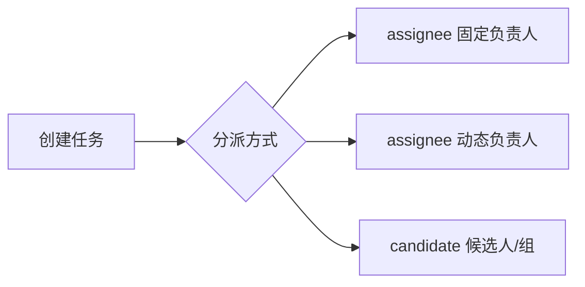
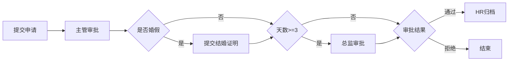
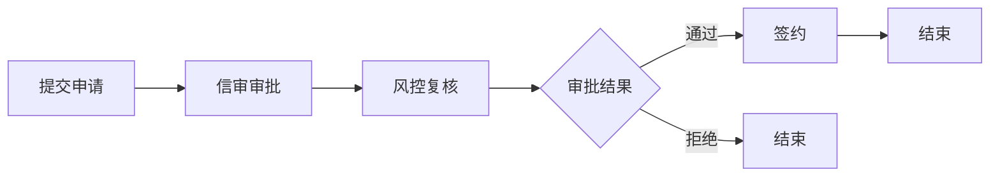
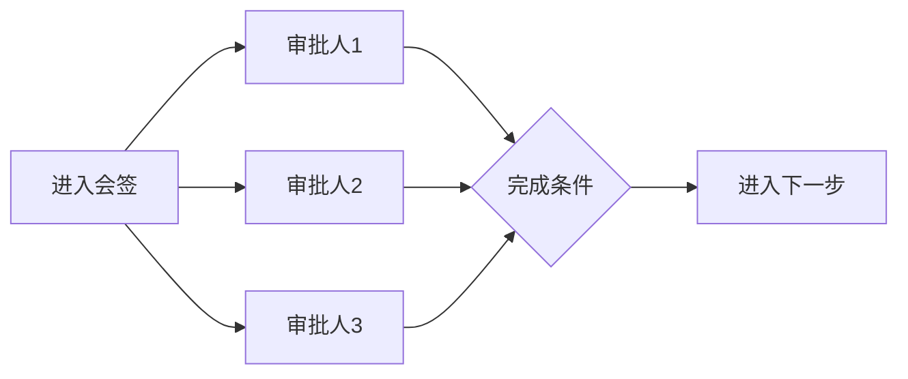
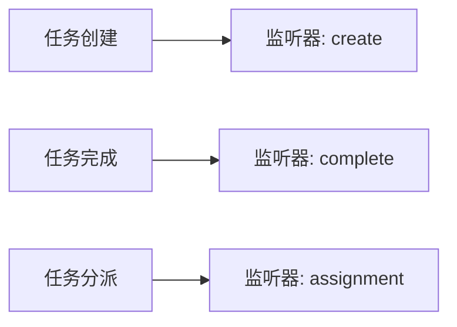
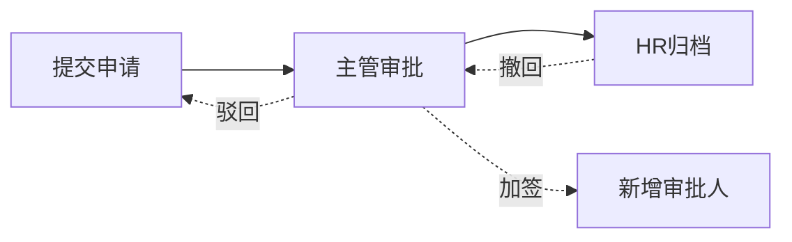
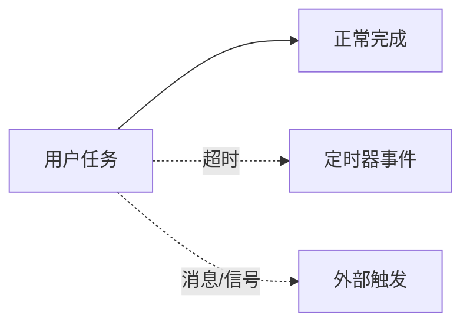
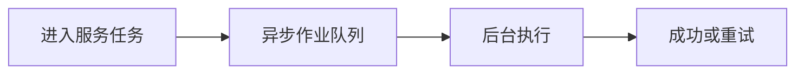
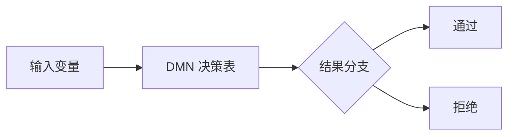
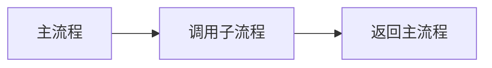

# Flowable 教程（循序渐进）

本教程基于 `haifa-workflow` 模块，通过实际案例一步步理解 Flowable 的核心概念与进阶功能。

## 1. 教程目标与环境准备

### 目标
1) 看懂 BPMN 流程文件的核心结构
2) 会部署、启动流程，并处理用户任务
3) 理解变量、网关、分派与动态流转等关键能力

### 环境准备
- JDK 21+
- Maven 3.x
- 本模块使用内存 H2 数据库，无需外部服务

### 代码位置
- 模块入口：`haifa-workflow`
- 流程定义：`haifa-workflow/src/main/resources/processes`

## 2. Flowable 概览：能解决什么问题

Flowable 是一套轻量级的工作流引擎，核心价值是把“业务流转”从代码里抽离成流程定义。
常见适用场景：
- 审批流程、业务编排、状态流转
- 需要“流程可视化 + 可配置”的业务场景
- 需要流程执行历史与审计的系统

### 核心模块
- BPMN 流程引擎：执行与管理流程实例
- 任务服务：查询/分派/完成任务
- 历史服务：审计与流程追溯
- 可选 DMN / CMMN：规则与案例管理

## 3. 第一个流程（请假）：从运行到看到任务

运行示例：`org.wrj.workflow.demo.LeaveWorkflowDemoApp`

执行流程：
1) 部署 BPMN
2) 启动流程实例
3) 依次完成任务

关键输出：
- 流程实例 ID
- 每个任务的名称与处理人

可以先不理解 BPMN 文件内容，直接运行看日志输出，建立“流程会动起来”的直观感受。

## 4. BPMN 基础：事件、任务、网关、连线

在 `processes/leave-request.bpmn20.xml` 中可以看到几个关键元素：
- `startEvent`：流程开始
- `userTask`：人工任务（需要人处理）
- `exclusiveGateway`：排他网关（根据条件走一条分支）
- `sequenceFlow`：连线与条件表达式

### 最小可执行流程的结构
最少需要：开始事件 + 至少一个任务 + 结束事件 + 连线。
Flowable 会按连线顺序推动流程执行。

## 5. 流程部署与启动：Repository/Runtime/Task 的职责

Flowable 的三大核心服务：
- `RepositoryService`：管理流程定义与部署
- `RuntimeService`：启动与运行流程实例
- `TaskService`：查询/分派/完成用户任务

对应到代码：
- 部署：`WorkflowSupport.deployProcesses`
- 启动：`LeaveWorkflowDemoApp.runLeaveScenario`

### 最小部署与启动代码示例
```java
repositoryService.createDeployment()
        .addClasspathResource("processes/leave-request.bpmn20.xml")
        .deploy();

runtimeService.startProcessInstanceByKey("leaveRequest", variables);
```

## 6. 流程变量与表达式：条件、网关、表单字段

流程变量是流程的“上下文数据”，用于驱动流程走向与任务分派。
常见用途：
- 网关条件判断（如 `days >= 3`）
- 任务指派（如 `flowable:assignee="${employee}"`）

### 示例变量
- `days`：请假天数
- `leaveType`：请假类型（婚假等）
- `approved`：审批结果

### 表达式示例
```xml
<conditionExpression xsi:type="tFormalExpression"><![CDATA[${days >= 3}]]></conditionExpression>
```

### 提示
变量名必须与代码中的 `Map<String, Object>` 对应；
表达式区分大小写，避免变量命名不一致。

## 7. 用户任务与分派：负责人、候选人、组与动态分配

用户任务通常需要“谁来处理”这一关键信息。Flowable 提供多种分派方式：

常用方式：
- 负责人：`flowable:assignee="manager"`
- 动态负责人：`flowable:assignee="${employee}"`
- 候选人/候选组：通过 `TaskService` 动态设置

### 简化示意图


### 代码提示
```java
taskService.addCandidateUser(taskId, "viceManager");
```

进阶示例：
- `LeaveAdvancedDemoApp` 中演示了“加签”（为任务添加候选人）

## 8. 请假流程进阶：婚假证明 + >=3 天总监审批

流程特性：
- 婚假需提交结婚证明
- 请假天数 >= 3 需要总监审批

对应配置：
- `leaveType == 'marriage'` 走婚假证明节点
- `days >= 3` 进入总监审批节点

对应流程文件：
- `processes/leave-request.bpmn20.xml`

### 流程示意图


### 说明
这里用两个网关拆分两个业务规则：
1) 是否婚假（是否需要证明）
2) 天数阈值（是否需要总监审批）

## 9. 银行贷款信审流程：信审、风控、签约

示例入口：
- `org.wrj.workflow.demo.LoanWorkflowDemoApp`

流程步骤：
1) 贷款申请
2) 信审审批
3) 风控复核
4) 签约归档

对应流程文件：
- `processes/loan-approval.bpmn20.xml`

### 流程示意图


### 说明
流程走向以 `approved` 变量为条件，风控环节完成时决定是否进入签约。

## 10. 多实例任务：会签/或签与完成条件

适用于：
- 多人联合审批（会签）
- 任一通过即通过（或签）

关键概念：
- `nrOfInstances`：实例数
- `completionCondition`：完成条件

可扩展建议：
- 在贷款或请假流程里增加“多名审批人”环节

### 流程示意图


### 说明
会签关注“多数通过/全部通过”的完成条件，或签关注“任一通过即结束”。

## 11. 监听器与扩展：任务监听器/执行监听器

用途：
- 任务创建时自动分派
- 完成时写入审计数据
- 触发外部系统调用

常见点位：
- `create` / `complete` / `assignment`

### 监听器示意


### 说明
监听器适合做“流程内的扩展逻辑”，例如记录审计日志、补充业务字段等。

## 12. 动态流转：驳回/撤回/加签/自由跳转

示例入口：
- `org.wrj.workflow.demo.LeaveAdvancedDemoApp`

演示内容：
- 加签：`taskService.addCandidateUser`
- 驳回：运行时从审批退回到提交
- 撤回：运行时从 HR 拉回主管审批

核心 API：
- `RuntimeService.createChangeActivityStateBuilder()`

### 流程示意图


### 说明
动态流转属于“运行时干预”，需要严格的权限控制与审计记录。
适合演示与理解，但生产环境应明确规则与审批边界。

## 13. 事件体系：边界事件、定时器、消息/信号

常见用途：
- 超时自动提醒（定时器）
- 外部系统触发流程（消息/信号）
- 任务中断或补偿（边界事件）

### 流程示意图


### 示例：任务超时提醒（定时器边界事件）
```xml
<userTask id="managerApproval" name="Manager Approval"/>
<boundaryEvent id="timerBoundary" attachedToRef="managerApproval" cancelActivity="false">
  <timerEventDefinition>
    <timeDuration>PT24H</timeDuration>
  </timerEventDefinition>
</boundaryEvent>
<serviceTask id="timeoutNotice" name="Timeout Notice" />
<sequenceFlow sourceRef="timerBoundary" targetRef="timeoutNotice"/>
```

### 说明
定时器边界事件可设置为不打断任务（`cancelActivity="false"`），用于提醒或记录日志。
消息/信号事件适合“外部系统回调”或“跨流程通知”的场景。

## 14. 异步与作业：异步任务、重试、作业管理

适用场景：
- 耗时任务异步执行
- 失败自动重试

关键点：
- 异步服务任务
- 作业表与执行器

### 流程示意图


### 示例：异步服务任务
```xml
<serviceTask id="asyncTask" name="Async Call" flowable:async="true"/>
```

### 说明
异步任务会交给作业执行器处理，适合调用外部系统或耗时逻辑。
失败会按配置自动重试，可结合历史记录做审计。

## 15. 决策集成：DMN 决策表驱动分支

适合：
- 规则复杂、可维护性要求高
- 审批规则经常变化

思路：
- 使用 DMN 管理规则
- BPMN 网关调用 DMN 输出结果

### 什么是 DMN
DMN（Decision Model and Notation）是一种“规则表驱动”的决策建模标准。
它用表格描述规则条件与输出，避免把复杂的 if/else 写进流程或代码里。

### 流程示意图


### DMN 示例（简化）
下面示例用 `loanAmount` 和 `creditScore` 决定审批结果：

```xml
<definitions xmlns="https://www.omg.org/spec/DMN/20191111/MODEL/"
             id="loanDecision" name="Loan Decision" namespace="http://www.wrj.org/dmn">
  <decision id="loanApprovalDecision" name="Loan Approval">
    <decisionTable hitPolicy="FIRST">
      <input id="input1" label="loanAmount">
        <inputExpression typeRef="number"><text>loanAmount</text></inputExpression>
      </input>
      <input id="input2" label="creditScore">
        <inputExpression typeRef="number"><text>creditScore</text></inputExpression>
      </input>
      <output id="output1" name="approved" typeRef="boolean"/>
      <rule>
        <inputEntry><text>&lt;= 300000</text></inputEntry>
        <inputEntry><text>&gt;= 700</text></inputEntry>
        <outputEntry><text>true</text></outputEntry>
      </rule>
      <rule>
        <inputEntry><text>&gt; 300000</text></inputEntry>
        <inputEntry><text>&lt; 700</text></inputEntry>
        <outputEntry><text>false</text></outputEntry>
      </rule>
    </decisionTable>
  </decision>
</definitions>
```

### BPMN 调用示例
```xml
<businessRuleTask id="loanDecision" name="Loan Decision"
                  flowable:decisionTableReferenceKey="loanApprovalDecision"
                  flowable:resultVariable="approved"/>
```

### 说明
DMN 用规则表替代复杂的 if/else，适合审批额度、风控等级等场景。
流程中可先执行决策，再根据结果变量走分支。

## 16. 子流程与调用活动：复用与编排

用途：
- 通用审批子流程复用
- 将流程拆分成可组合模块

常见方式：
- `callActivity`
- `subProcess`

### 流程示意图


### 示例：调用活动
```xml
<callActivity id="callSubProcess" calledElement="commonApproval"/>
```

### 子流程示例（嵌入式）
```xml
<subProcess id="reviewSubProcess" name="Review SubProcess">
  <startEvent id="subStart"/>
  <userTask id="subReview" name="Sub Review" flowable:assignee="reviewer"/>
  <endEvent id="subEnd"/>
  <sequenceFlow sourceRef="subStart" targetRef="subReview"/>
  <sequenceFlow sourceRef="subReview" targetRef="subEnd"/>
</subProcess>
```

### 代码示例：启动并传递变量
```java
Map<String, Object> variables = new HashMap<>();
variables.put("employee", "zhangsan");
runtimeService.startProcessInstanceByKey("leaveRequest", variables);
```

### 说明
子流程适合“内部复用”，调用活动适合“跨流程复用”。
调用活动可传入变量并接收输出变量，便于模块化编排。

## 17. 权限与租户：用户/组、候选人、租户隔离

关注点：
- 用户/组与候选人绑定
- 多租户隔离与资源归属

### 示例：任务候选组
```java
taskService.addCandidateGroup(taskId, "hr");
```

### 说明
候选组适合“部门级审批”，由组内任一成员拾取任务处理。
多租户场景下需明确流程定义、实例与任务的租户归属。

## 18. 历史与审计：历史级别、实例回溯与报表

Flowable 支持多级历史记录：
- 活动、任务、变量、审计

常见查询：
- 流程实例历史
- 任务处理历史

### 示例：查询历史任务
```java
historyService.createHistoricTaskInstanceQuery()
        .processInstanceId(processInstanceId)
        .orderByHistoricTaskInstanceStartTime()
        .asc()
        .list();
```

### 说明
历史级别越高，记录越完整但开销也越大。
生产环境建议按审计需求选择合适级别。

## 19. 版本与迁移：流程升级、实例迁移策略

流程更新后：
- 新实例走新版本
- 老实例可选择迁移

核心能力：
- 实例迁移与版本管理

## 20. 常见问题与排错

- 依赖缺失：检查 `flowable-engine` 与 `mybatis`
- 流程找不到：确认 BPMN 路径与流程 key
- 变量不生效：检查表达式与变量名

## 21. 延伸实践建议与参考资料

建议实践路线：
1) 请假流程增加多实例会签
2) 贷款流程引入 DMN 规则表
3) 任务监听器写入审计日志

参考：
- https://www.flowable.com/open-source/docs
